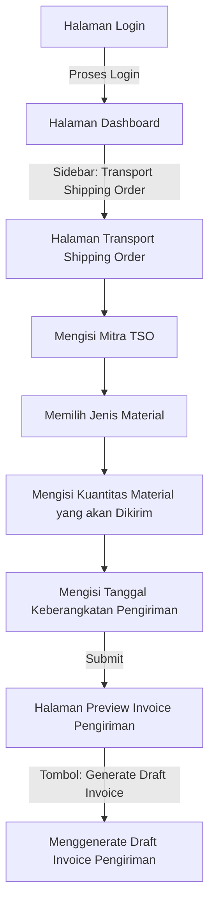

# DOKUMEN SPESIFIKASI FITUR TRANSPORT SHIPPING ORDER (TSO) PADA APLIKASI STOCK MONITOR DAN TSO

## 1. Latar Belakang

**Panggih** adalah seorang **leader** dari tim marketing pada perusahaan **oil and gas**, sejenis dengan PT. PERTAMINA (Persero). Panggih bertanggung jawab atas distribusi stok minyak tanah dan LPG untuk daerah Indonesia Timur. Pada periode tertentu, dia harus mengatur pengiriman minyak tanah maupun LPG saat ketersediaan stok di gudang wilayahnya menipis. Dalam prosesnya, dia akan menghubungi pihak ketiga yang akan menjadi **transporter** untuk menegosiasikan pengiriman dari gudang pusat ke gudang wilayah.

## 2. Definisi Fitur

Fitur **Transport Shipping Order** ini mirip dengan proses pemilihan metode pengiriman barang pada e-commerce umumnya. Nantinya, Manager Wilayah akan memilih lokasi gudang wilayah tujuan pengiriman, transporter, dan rute-rute yang akan dilalui. Setelah konfigurasi pengiriman dibuat, informasi pada halaman konfigurasi pengiriman akan digenerate menjadi dokumen proposal untuk kemudian didiskusikan dengan pemangku kepentingan terkait.

Setiap pengiriman yang dibuat melalui TSO berdampak langsung pada stok yang dimonitor oleh Fitur Monitoring Stok (mengikuti Invarian Konservasi Stok pada `STOCK_MONITORING_SPEC.md` §2.c): **saat proses keberangkatan dimulai**, kuantitas material otomatis ter-debit dari stok sumber dan tercatat sebagai **Rencana Kedatangan** (Next Supply + ETA) pada entitas gudang wilayah tujuan; saat barang tiba, stok tujuan otomatis bertambah. Tidak boleh ada selisih antara stok yang diberangkatkan dan stok yang tercatat.

## 3. Definisi Role

Dalam proses operasional fitur ini, ada empat pihak yang memiliki otoritas untuk melakukan transaksi data:

| Pihak      | Otoritas                                 | Keterangan                            |
| ---------- | ---------------------------------------- | ------------------------------------- |
| Superadmin | Create Read Update Delete | Webmaster                             |
| Operator   | Create Read                         | Melakukan pengisian data setiap hari |
| Supervisi  | Read Update                         | Melakukan pengecekan dan penggantian data jika diperlukan |
| Tamu       | Read                                     | Melakukan pemantauan data             |

> Catatan: role pada modul TSO diselaraskan dengan role pada modul Monitoring Stok (`STOCK_MONITORING_SPEC.md` §3), termasuk Supervisi (Read/Update). Otoritas multi-role, manajemen role/password, logout, dan session expiry mengikuti `STOCK_MONITORING_SPEC.md` §6.

## 4. Alur Interaksi pada Fitur Transport Shipping Order (TSO)

Pada pendefinisian alur interaksi, kedepannya, aktor akan disebut sebagai **pihak**. Alur interaksi dalam pengoperasian dashboard ini adalah sebagai berikut:

### a. Halaman Login (Login Page)

Pihak memasukkan alamat aplikasi pada browser, kemudian tiba pada halaman login. Pihak kemudian memasukkan kredensial yang dimiliki untuk melakukan proses login.

### b. Halaman Dashboard

Setelah proses login sukses, pihak akan tiba pada Halaman Dashboard. Dari halaman ini:

1. Pihak mengakses menu navigasi sidebar.
2. Pihak memilih opsi Transport Shipping Order untuk diarahkan ke halaman pembuatan TSO.

### c. Halaman Transport Shipping Order

Pada halaman ini, terdapat form pengiriman yang harus dilengkapi oleh pihak, yang meliputi:

1. Pihak memilih data Mitra TSO dari master Mitra TSO (dimuat dari `seeds/mitra-tso.json`), bukan mengetik bebas.
2. Pihak memilih opsi dropdown Jenis Material yang akan dikirim: salah satu SKU LPG (Tabung 5.5kg, 12kg, atau 50kg) atau Minyak Tanah.
3. Pihak mengisi Kuantitas Material yang akan dikirim, dengan satuan mengikuti jenis material (Tabung untuk LPG; Kiloliter untuk Minyak Tanah).
4. Pihak mengisi Tanggal Keberangkatan Pengiriman.
5. Pihak menekan tombol Submit. Pada titik ini **order ter-commit**. Dampak stok (debit sumber + pencatatan Rencana Kedatangan di Gudang Wilayah tujuan) berlaku saat proses keberangkatan dimulai, mengikuti Invarian Konservasi Stok pada `STOCK_MONITORING_SPEC.md` §2.c.
6. Sistem mengarahkan pihak ke Halaman Preview Invoice Pengiriman.

### d. Halaman Preview Invoice Pengiriman

Setelah menekan tombol submit (order telah ter-commit), pihak akan diarahkan ke Halaman Preview Invoice Pengiriman. **Preview** adalah tampilan read-only di layar yang merangkum data order yang telah ter-commit; preview tidak mengubah data. Pada halaman ini:

1. Pihak memeriksa kelengkapan ringkasan data pengiriman.
2. Pihak menekan tombol Generate Draft Invoice.
3. Sistem menghasilkan dokumen **Draft Invoice Pengiriman** dalam format **PDF** dengan kolom minimal:
   - Mitra TSO
   - Gudang Wilayah tujuan
   - Jenis Material
   - Kuantitas + satuan (Tabung / Kiloliter)
   - Tanggal Keberangkatan
   - ETA estimasi
   - Nomor order
   - Timestamp generate
4. Generate hanya mengubah media (tampilan → file PDF); regenerasi atas order yang sama menghasilkan dokumen yang identik (idempotent, tanpa nomor dokumen baru).

### e. Halaman Update Order

Halaman ini hanya bisa diakses oleh **Superadmin** dan **Supervisi** (role dengan otoritas Update, lihat §3). Operator (Create/Read) dan Tamu (Read) tidak melihat tombol Update.

1. Pihak membuka tombol Update pada baris order yang dituju.
2. Form menampilkan field yang sama dengan Halaman Transport Shipping Order (§4.c), dengan nilai terisi (pre-filled) dari order yang dituju.
3. Pihak mengubah data, lalu menekan tombol Submit.
4. Perubahan order tercatat di audit log (pihak, waktu, role, nilai sebelum/sesudah).

### f. Mekanisme Hapus Order

Penghapusan order hanya dapat dilakukan oleh **Superadmin** (satu-satunya role dengan otoritas Delete, lihat §3).

1. Superadmin menekan tombol hapus pada baris order yang dituju.
2. Muncul modal konfirmasi berisi ringkasan order (Mitra TSO, Jenis Material, Kuantitas, Tanggal Keberangkatan).
3. Setelah konfirmasi, order dihapus (soft delete).
4. Riwayat order tetap tersimpan di audit log untuk keperluan pelacakan.
5. Role selain Superadmin tidak melihat tombol hapus.

## 5. Guardrails dan Fallbacks

### 5.1 Guardrails (Pencegahan)

| No. | Guardrail | Ketentuan |
| --- | --- | --- |
| T1 | Idempotensi pembuatan TSO | Submit ganda dicegah; satu order menghasilkan paling banyak satu Draft Invoice. |
| T2 | Kuantitas > 0 | Kuantitas Material wajib bernilai > 0, satuan mengikuti Jenis Material (Tabung untuk LPG; Kiloliter untuk Minyak Tanah). |
| T3 | Jenis Material kanonik | Jenis Material harus dari enum master yang sama dengan modul Monitoring Stok (LPG Tabung 5.5kg/12kg/50kg atau Minyak Tanah) — lihat `STOCK_MONITORING_SPEC.md` §2.c. |
| T4 | Mitra TSO dari master | Mitra TSO (transporter) wajib dipilih dari master `seeds/mitra-tso.json`; input bebas ditolak. |
| T5 | Dampak stok saat keberangkatan | Saat Tanggal Keberangkatan diproses, kuantitas otomatis ter-debit dari sumber dan tercatat sebagai Rencana Kedatangan (Next Supply + ETA) pada Gudang Wilayah tujuan, mengikuti Invarian Konservasi Stok `STOCK_MONITORING_SPEC.md` §2.c. |
| T6 | Tanggal Keberangkatan valid | Tanggal Keberangkatan tidak boleh mendahului tanggal saat ini saat order disubmit. |
| T7 | Otorisasi per role | Setiap aksi mutasi memeriksa role aktif sesuai §3 (Superadmin/Operator/Supervisi/Tamu) dan `STOCK_MONITORING_SPEC.md` §6. |
| T8 | Keamanan & audit | Tidak ada rahasia di kode sumber; query terparameterisasi; pembuatan/perubahan/penghapusan order tercatat di audit log. |
| T9 | Generate Draft Invoice idempoten | Regenerasi invoice atas order yang sama menghasilkan dokumen identik, tanpa duplikasi nomor dokumen. |
| T10 | Akses dokumen terbatas | Draft Invoice hanya dapat dilihat/diunduh oleh role yang berhak. |
| T11 | Commit di Submit | Data order ter-commit pada saat Submit; Preview dan Generate Draft Invoice tidak mengubah data. |

### 5.2 Fallbacks (Skenario Reaktif)

- ### F1 — Invalid Credentials

  Ketika ada pihak yang hendak melakukan proses login, namun tidak memberikan kredensial yang benar, sebuah notifikasi yang menginformasikan bahwa kredensial yang dimasukkan salah akan muncul.
- ### F2 — Improper Credentials

  Ketika ada pihak yang melakukan proses login, namun tidak mengisikan kredensial secara lengkap, maka sebuah notifikasi peringatan (form validation) akan muncul pada form kredensial yang bermasalah.
- ### F3 — Mitra TSO tidak terdaftar

  Bila Mitra TSO yang dipilih tidak ada di master, sistem menolak dengan respons 400 (ProblemDetails).
- ### F4 — Jenis Material atau Kuantitas tidak diisi

  Form validation inline: Jenis Material dan Kuantitas wajib diisi; Kuantitas harus > 0 dengan satuan sesuai material.
- ### F5 — Tanggal Keberangkatan di masa lalu

  Bila Tanggal Keberangkatan mendahului tanggal hari ini, submit ditolak dengan pesan validasi.
- ### F6 — Gagal Generate Draft Invoice

  Bila pembuatan PDF gagal, data order tetap tersimpan; sistem menampilkan pesan error dan menawarkan percobaan ulang.
- ### F7 — Koneksi ke modul Monitoring Stok putus

  Bila layanan monitoring stok tidak tersedia, TSO tetap dapat dibuat dengan flag "dampak stok tertunda"; sinkronisasi ulang dilakukan saat layanan pulih.
- ### F8 — Konflik edit simultan

  Bila dua pihak mengubah order yang sama secara bersamaan, penulisan kedua ditolak dengan pesan "data telah diperbarui pihak lain, muat ulang" (optimistic concurrency).
- ### F9 — Submit ganda

  Idempotensi: submit yang terulang tidak membuat order/invoice ganda.
- ### F10 — ETA / Rencana Kedatangan tidak tersinkron

  Bila data Rencana Kedatangan pada modul Monitoring Stok tidak mencerminkan order TSO, sistem menandai "perlu sinkronisasi ulang".
- ### F11 — Idle session

  Sesi hangus setelah 15 menit tanpa aktivitas (idle timeout, lihat `STOCK_MONITORING_SPEC.md` §6.5); user diarahkan ke halaman login.
- ### F12 — Aksi tanpa wewenang

  Bila role aktif tidak memiliki otoritas untuk suatu aksi (mis. Operator mencoba Update/Delete), sistem menolak aksi dan menampilkan notifikasi.

---
