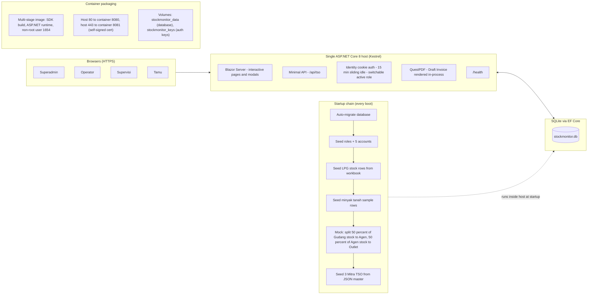
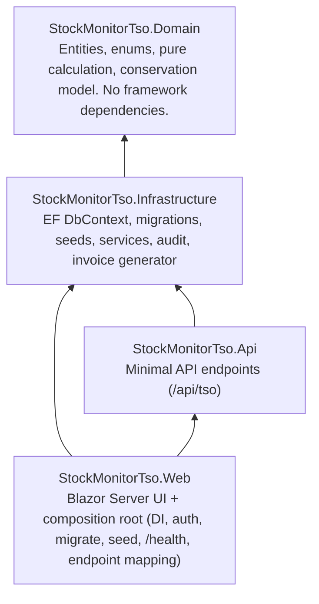

# 01 — System & Deployment Topology

Application: **Stock Monitor dan TSO** — one deployable web application with two modules
sharing a single shell (login + dashboard): **Monitoring Stok** (minyak tanah + LPG)
and **Transport Shipping Order (TSO)**.

## 1. Runtime topology

Notes:

- One Generic Host serves both the Blazor Server UI and the Minimal API. There is no
  separate API service or message bus.
- Auth state is a cookie. The only role claim emitted is the **active role**; a user with
  several roles picks one active role at login and may switch it mid-session. Permissions
  always follow the active role, never the union of roles.
- The PDF generator runs in-process; invoice rendering never leaves the host.
- A dedicated keys volume is mounted alongside the data volume so auth keys can
  survive container restarts.
- No external service is called at runtime. The workbook and the Mitra JSON file are
  read **only during startup seeding**; they are not polled or watched afterwards.

## 2. Code layering

| Layer | Owns | Rules |
|---|---|---|
| `StockMonitorTso.Domain` | Entities (`Wilayah`, `Produk`, `Tier`, `Agen`, `Outlet`, `StokEntitas`, `RencanaKedatangan`, `MitraTso`, `TransportOrder`, `StockTransactionRecord`, `AuditLog`), calculation service | No EF, no ASP.NET. Pure logic only. |
| `StockMonitorTso.Infrastructure` | `ApplicationDbContext`, migrations, seed loaders, all business services, invoice generator, audit logger | All stock changes happen here inside atomic transactions. |
| `StockMonitorTso.Api` | `MapGroup("/api/tso")` endpoints | Thin mapping to services. Never contains business logic. |
| `StockMonitorTso.Web` | Blazor pages, layout, `Program.cs` | UI calls services only. Never computes or mutates stock itself. UI tests: `xUnit` + `WebApplicationFactory`, SQLite temp database. |

## 3. Network surface

| Surface | Path | Auth | Purpose |
|---|---|---|---|
| UI | `/`, `/gudang-wilayah`, `/sales-area/register`, `/sales-area/{Wilayah}/{Produk}`, `/wilayah/{Wilayah}/agen`, `/agen/{AgenId}`, `/agen/{AgenId}/outlet`, `/outlet/{OutletId}`, `/tso`, `/tso/create`, `/tso/{Id}/edit`, `/tso/{Id}`, `/admin/users`, `/Account/*` | Cookie (login page for anonymous) | All screens |
| API | `POST /api/tso/`, `GET /api/tso/`, `GET /api/tso/{id}`, `PUT /api/tso/{id}`, `DELETE /api/tso/{id}`, `POST /api/tso/{id}/invoice`, `POST /api/tso/{id}/resync` | Cookie, `RequireAuthorization` | TSO orders as JSON + PDF download |
| Health | `/health` | None | Liveness probe, container health check |

## 4. Runtime configuration

| Item | Value |
|---|---|
| Database | SQLite file (`DataSource=stockmonitor.db`, local path in dev, `stockmonitor_data` volume in container) |
| Schema changes | EF Core migrations only (`Migrations/`), applied automatically at startup |
| Idle timeout | 15 minutes, sliding (every valid request resets the timer) |
| Default accounts (seeded, password length minimum 8, overridable via configuration) | `superadmin@stockmonitor.local` (Superadmin) · `operator@stockmonitor.local` (Operator) · `supervisi@stockmonitor.local` (Supervisi) · `tamu@stockmonitor.local` (Tamu) · `multi@stockmonitor.local` (Operator + Supervisi + Tamu, starts as Operator) |
| Order numbering | `TSO-YYYYMMDD-XXXX`, unique |
| TSO ETA rule | Tanggal Keberangkatan + 7 days |

## 5. Data-flow summary

- Browsers send forms and receive rendered pages; the Minimal API additionally serves
  TSO orders as JSON and the invoice as a PDF file download.
- Every write path funnels through a service in Infrastructure, which checks the active
  role first, then runs inside an EF Core transaction, then writes an audit row.
- Stock numbers are never edited directly: `Stok` changes only via `Receive` (in),
  `Issue` (sold, auto-adds to `StokHabisTerjual`), `Adjust` (opname, plus or minus),
  or `Transfer` (debit source + credit destination in one transaction). Any step that
  would push a tier below zero is rejected with "stok tidak mencukupi" and nothing changes.
