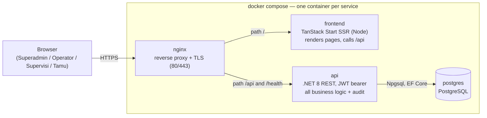
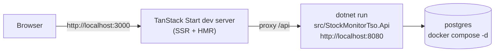

# 01 — System & Deployment Topology

Application: **Stock Monitor dan TSO** — two modules sharing one shell (login +
dashboard): **Monitoring Stok** (minyak tanah + LPG) and **Transport Shipping Order
(TSO)**.

> Reconstructed 2026-09: one container per service, monorepo. The Blazor Server
> single-host app is replaced by a React frontend (TanStack Start, SSR) plus a pure
> .NET 8 REST API, on PostgreSQL, fronted by nginx.

## 1. Runtime topology (production — docker compose)

Startup chain (inside the **api** container, every boot):
auto-migrate PostgreSQL → seed roles + 5 accounts → seed stock rows (mock or skipped
via flags; the workbook is optional and absent from the repo) → mock split: 50% of
Gudang stock to Agen, 50% of Agen stock to Outlet (audited as `Transfer`) → upsert
3 Mitra TSO from the JSON master.

Volumes & packaging:

| Container | Image source | Notes |
|---|---|---|
| nginx | stock image + `deploy/nginx/nginx.conf` | TLS termination, SPA/SSR routing, `/api` proxy, `/health` proxy |
| frontend | `frontend/Dockerfile` (node build → node runtime, non-root) | TanStack Start SSR server; serves pages and static assets |
| api | `src/StockMonitorTso.Api/Dockerfile` (multi-stage sdk→aspnet, non-root) | REST endpoints, JWT, QuestPDF in-process, auto-migrate + seed |
| postgres | stock image + `deploy/postgres/init/` | data in `pgdata` volume; healthcheck before api |

Notes:

- Auth is **stateless**: the api issues JWT bearer tokens (access 15 min + refresh).
  Server-side auth key volumes are no longer needed for sessions.
- nginx never executes application logic; it routes and terminates TLS.
- No other external service is called at runtime; the JSON Mitra master is read only
  during seeding and the Superadmin Mitra screens manage it afterwards.

## 2. Auth flow (JWT bearer)

1. `POST /api/auth/login` — email + password (+ active role for multi-role users) →
   access token (15-min expiry, active-role claim) + refresh token.
2. Every api call carries `Authorization: Bearer <access token>`.
3. `POST /api/auth/refresh` on activity — new access token; the 15-minute idle window
   slides; after expiry the user logs in again.
4. `POST /api/auth/switch-role` — validates membership server-side, re-issues the
   token with the new active-role claim. Never client-side only.
5. `POST /api/auth/logout` — revokes the refresh token; client discards the access token.
6. `GET /api/auth/me` — current user, roles, active role (session bootstrap).

## 3. Dev topology (no nginx needed)

## 4. Monorepo layering

| Layer | Owns | Rules |
|---|---|---|
| `frontend/` | TanStack Start pages, TanStack Router/Query/Form, Tailwind `sm-*` tokens, auth interceptor | Presentation only. No business logic; calls the REST API; hides controls per role but never relies on that for enforcement. |
| `StockMonitorTso.Api` | Minimal API endpoints (auth, dashboard, stock, agen, outlet, users, tso, mitra), JWT config, composition root | Thin mapping to services; ProblemDetails on all errors; role checks mirror the service matrix. |
| `StockMonitorTso.Domain` | Entities, enums, pure calculation, conservation model | No framework dependencies. |
| `StockMonitorTso.Infrastructure` | Npgsql `DbContext`, migrations, seeds, all business services, audit, invoice generator | All stock changes in atomic transactions here. |
| `StockMonitorTso.Web` | Blazor (legacy during transition) | Retired at R5. |

## 5. Network surface

| Route | Target | Auth | Purpose |
|---|---|---|---|
| `/` … | frontend container | none (public shell) | Login page and app shell; route guards are cosmetic — API enforces |
| `/api/auth/*` | api | mixed (login open; rest bearer) | login, refresh, logout, me, switch-role |
| `/api/dashboard`, `/api/stock`, `/api/agen`, `/api/outlet` | api | bearer | monitoring module |
| `/api/tso`, `/api/mitra` | api | bearer | TSO orders, invoices (PDF download), Mitra admin |
| `/api/users` | api | bearer (Superadmin) | user + role management |
| `/health` | api | none | liveness; nginx proxies it for compose healthchecks |

## 6. Configuration

| Item | Value |
|---|---|
| Database | PostgreSQL (Npgsql), connection string via env (`ConnectionStrings__DefaultConnection`) |
| JWT | issuer/audience/key via env or user-secrets — never in source |
| Idle timeout | 15 minutes, sliding (activity triggers refresh) |
| Schema changes | EF Core Npgsql migrations only, applied automatically at api startup |
| Order numbering | `TSO-YYYYMMDD-XXXX`, unique |
| TSO ETA rule | Tanggal Keberangkatan + 7 days |

## 7. Branches

- `main` — **main repository**: full documentation set + all code.
- `apps` — **production update point**: app + deploy artifacts only
  (`src/`, `tests/`, `frontend/`, `deploy/`, `seeds/`, Docker files); documentation
  never goes there.

## 8. Data-flow summary

- The browser talks only to nginx: pages come from the SSR frontend, data from the
  REST api (JSON), invoices as PDF downloads.
- Every write path funnels through an Infrastructure service: role check (active-role
  claim) → EF transaction → audit row. Stock numbers change only via `Receive`,
  `Issue`, `Adjust±`, `Transfer` (atomic, overdraft rejected).
- Reads are computed at request time from PostgreSQL snapshots (CD, Exhaust Date,
  Status, MT, aggregates).
