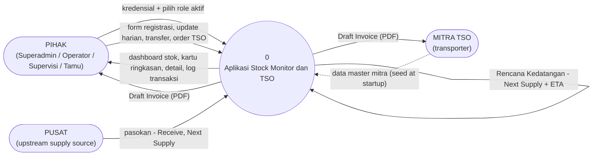

# 02 — DFD Level 0 (Context Diagram)

The whole application is a single process (0). Everything outside it is an external
entity. The database is internal to the system and is not shown at this level.

## Diagram

## Flow catalog

| # | From | To | Data | Notes |
|---|---|---|---|---|
| F1 | Pihak | 0 | Email + password; chosen active role (for multi-role users) | Failed or incomplete credentials loop back to the login page with a notice. |
| F2 | Pihak | 0 | Register Sales Area forms (minyak tanah or LPG rows), Update Data Harian entries, transfer requests (destination + qty per SKU), TSO wizard submissions | Each flow is gated by the active role (see matrix in `03-dfd-level-1.md`). |
| F3 | 0 | Pihak | Dashboard (summary cards, sales-area cards, charts), detail tables with computed CD / Exhaust Date / Status / MT, transaction logs | Read access is open to all four roles. |
| F4 | 0 | Pihak, Mitra | Draft Invoice PDF (Mitra, destination Gudang Wilayah, material, quantity + unit, departure date, ETA, order number, generation timestamp) | Generating the PDF changes nothing; regenerating the same order yields byte-identical output. |
| F5 | Mitra (master) | 0 | Mitra identity, vehicle, capacity, routes, area coverage, contact, tariff | Loaded at startup from a JSON file; afterwards maintained by Superadmin (create, update, per-product tariff) and read by the order flow. |
| F6 | Pusat | 0 | Incoming supply recorded as `Receive`, plus future supply recorded as arrival plans | No central-stock balance is tracked; only quantity greater than zero is enforced. |
| F7 | 0 | (internal) | `Rencana Kedatangan` (Next Supply + ETA, up to 3 slots per stock row) on the destination Gudang Wilayah | Created when a TSO order is committed; if creation fails, the order is flagged "dampak stok tertunda" and synced later. |

## System boundary

**Inside process 0:** authentication and sessions, role management, stock computation,
stock registration and updates, atomic stock transactions, Agen/Outlet inventory and
transfers, TSO orders, Mitra administration, invoice generation, audit logging, the
PostgreSQL database.

**Deployment note (2026-09 reconstruction):** process 0 executes inside the **api**
container (.NET 8 REST, JWT bearer). The React frontend (TanStack Start SSR, behind
nginx) is the presentation layer only — it renders screens and forwards Pihak input to
the REST endpoints; all processes, guards, and stores above live in the api container
and PostgreSQL.

**Outside:** the four human roles (grouped as one external entity because they all use
the same screens with different permissions), the transporter companies named in the
Mitra master, and the upstream supply point (Pusat) that ships to Gudang Wilayah.
End consumers (masyarakat) are out of scope — they never touch the system.
