# 03 — DFD Level 1 (Processes + Data Stores)

Process 0 from Level 0 is decomposed into 8 processes and 7 data stores.
`PIHAK`, `MITRA`, and `PUSAT` are the external entities from Level 0.

## Diagram

```mermaid
flowchart TB
    PIHAK(["PIHAK"])
    MITRA(["MITRA TSO"])
    PUSAT(["PUSAT"])

    subgraph PROCS["Processes"]
        P1("1.0<br/>Autentikasi dan Sesi")
        P2("2.0<br/>Manajemen User dan Role")
        P3("3.0<br/>Pemantauan Stok")
        P4("4.0<br/>Registrasi dan Update Data Stok")
        P5("5.0<br/>Transaksi Stok (Konservasi)")
        P6("6.0<br/>Inventaris Agen dan Outlet")
        P7("7.0<br/>Order TSO")
        P8("8.0<br/>Draft Invoice")
    end

    subgraph STORES["Data stores"]
        D1[("D1 - Identity")]
        D2[("D2 - StokEntitas + RencanaKedatangan")]
        D3[("D3 - Agen + Outlet")]
        D4[("D4 - MitraTso")]
        D5[("D5 - TransportOrder")]
        D6[("D6 - StockTransactions")]
        D7[("D7 - AuditLogs")]
    end

    PIHAK -->|"kredensial, pilih role, switch role, logout"| P1
    P1 <-->|"users, roles, active role"| D1
    P1 -->|"sesi + klaim role aktif"| PIHAK

    PIHAK -->|"buat user, assign role, ganti password (Superadmin)"| P2
    P2 <-->|"users, roles"| D1
    P2 -->|"audit"| D7

    PIHAK -->|"filter wilayah dan obyek"| P3
    P3 -->|"baca stok, agen, outlet"| D2
    P3 -->|"baca identitas"| D3
    P3 -->|"ringkasan, kartu, tabel, log"| PIHAK

    PIHAK -->|"register, update detail, hapus"| P4
    P4 -->|"tulis baris stok"| D2
    P4 -->|"audit"| D7

    PIHAK -->|"Receive, Issue, Adjust, Transfer"| P5
    PUSAT -->|"pasokan"| P5
    P5 <-->|"debit dan kredit atomik"| D2
    P5 -->|"catat mutasi"| D6
    P5 -->|"audit"| D7
    P5 -->|"stok baru, log"| PIHAK

    PIHAK -->|"buat, ubah, hapus agen dan outlet; kirim ke agen, kirim ke outlet"| P6
    P6 <-->|"identitas + baris stok per produk"| D3
    P6 -->|"transfer antar-tier"| P5
    P6 -->|"audit"| D7

    PIHAK -->|"buat, ubah, hapus order; resync"| P7
    P7 -->|"baca master mitra"| D4
    P7 -->|"tulis order"| D5
    P7 -->|"tulis Next Supply + ETA gudang tujuan"| D2
    P7 -->|"audit"| D7
    P7 -->|"order ter-commit"| PIHAK

    PIHAK -->|"preview, generate PDF"| P8
    P8 -->|"baca order"| D5
    P8 -->|"baca mitra"| D4
    P8 -->|"Draft Invoice PDF"| PIHAK
    P8 -->|"Draft Invoice PDF"| MITRA
```

## Process table

| # | Process | In | Out | Who may mutate |
|---|---|---|---|---|
| 1.0 | Autentikasi dan Sesi — login, active-role selection, in-session role switch, 15-min sliding idle, explicit logout | Credentials, role choice | Session cookie carrying only the active role | — (system) |
| 2.0 | Manajemen User dan Role — create user (email + password + roles + explicit active role), assign/remove role, set password | Admin forms | Users/roles updated, audit rows | Superadmin only |
| 3.0 | Pemantauan Stok — summary cards, sales-area cards (LPG grouped 1 card per wilayah with 3 size chips), detail tables, transaction log | Filters | Computed CD / Exhaust Date / Status / MT, aggregates | Read: all roles |
| 4.0 | Registrasi dan Update Data Stok — Register Sales Area (branching minyak 2 rows vs LPG 6 rows), update detail (pre-filled), soft-delete with confirm modal | Forms | Stock rows created/updated/flagged deleted, audit rows | Register: Superadmin + Operator · Update: Superadmin + Supervisi · Delete: Superadmin |
| 5.0 | Transaksi Stok (Konservasi) — the only writer of `Stok`, always inside one DB transaction | `Receive` / `Issue` / `Adjust` / `Transfer` + qty + optional destination | Changed balances, transaction records, audit rows | Superadmin + Supervisi (Receive also via 4.0 register path: Superadmin + Operator) |
| 6.0 | Inventaris Agen dan Outlet — named identity CRUD (auto-creates zero stock rows per product), "Kirim ke Agen" and "Kirim ke Outlet" modals (one destination + qty per SKU, one atomic `Transfer` per SKU) | Identity forms, transfer requests | Identity rows, stock rows, audit rows | Create/Update identity: Superadmin + Supervisi · Delete identity: Superadmin |
| 7.0 | Order TSO — 4-step wizard, commit at Submit, 1-minute duplicate guard, price snapshot, arrival-plan impact | Wizard payload (destination, route, dates, mitra, product, qty) | Committed order, arrival plan on destination Gudang Wilayah, audit rows | Create: Superadmin + Operator · Update: Superadmin + Supervisi · Delete: Superadmin |
| 8.0 | Draft Invoice — read-only preview + deterministic PDF generation | Order id | PDF bytes (byte-identical on regenerate) | Roles entitled to view the order |

Every mutation in 2.0 and 4.0–7.0 appends to **D7 AuditLogs** (actor, active role, time,
entity, before/after values).

## Data store table

| Store | Holds | Key rules |
|---|---|---|
| D1 Identity | Users, roles, user-role links, `ActiveRoleName` | Assign role and password changes are Superadmin-only, enforced in the service layer. |
| D2 StokEntitas + RencanaKedatangan | One row per (Wilayah × Produk × Tier); Agen rows carry `AgenId`, Outlet rows carry `OutletId`; up to 3 arrival slots per row | Filtered unique indexes per row shape. Written only by 4.0, 5.0, and 7.0. |
| D3 Agen + Outlet | Named identities (`Agen`: unique name per Wilayah, 2–3 per Gudang; `Outlet`: unique name per Agen, 2 per Agen) | Soft delete; stock rows reference them. |
| D4 MitraTso | Transporter master: id, name, vehicle, capacity, routes, area coverage, contact, PIC, tariff | Seed-loaded at startup, read-only afterwards. |
| D5 TransportOrder | Order header: order no, mitra + name snapshot, tariff + cost snapshot, destination, route, product, qty + unit, departure, ETA, status (`Committed` / `StockImpacted` / `FlagTertunda`), concurrency token | Soft delete; price snapshot freezes the order against later tariff changes. |
| D6 StockTransactions | One row per mutation (source before/after; destination before/after for transfers) | Append-only. |
| D7 AuditLogs | Who did what, with which active role, when, before/after | Append-only. |

## Rules applied inside the processes

**Computation (3.0):** `CD = Stok ÷ DOT` (blank "N/A" when DOT is 0) ·
`Exhaust Date = Tanggal Stok Awal + CD` · Status: Kritis when CD < 3, Warning when
3 ≤ CD < 7, Aman when CD ≥ 7 · After arrival plan n:
`CD_n = (remaining stock at ETA_n + Next Supply_n) ÷ DOT`,
`Exhaust_n = ETA_n + CD_n` · LPG only: `MT = Tabung × size weight ÷ 1000`.

**Units (4.0, 5.0, 7.0):** LPG is counted in Tabung, minyak tanah in Kiloliter;
mixed units are rejected.

**Conservation (5.0):** `Receive` adds · `Issue` subtracts and auto-adds the same qty
to `StokHabisTerjual` · `Adjust` adds a signed qty (opname, never 0) · `Transfer`
debits source and credits destination in one transaction, same Wilayah only.
Any path that would leave a tier below zero is rejected ("stok tidak mencukupi")
and changes nothing.

**Distribution timing:** Gudang Wilayah → Agen → Outlet legs are same-day
(request date = arrival date). Pusat → Gudang Wilayah legs (7.0) carry a variable
lead time; ETA is an estimate (departure + 7 days), and overdue arrivals are flagged
"Terlambat".
