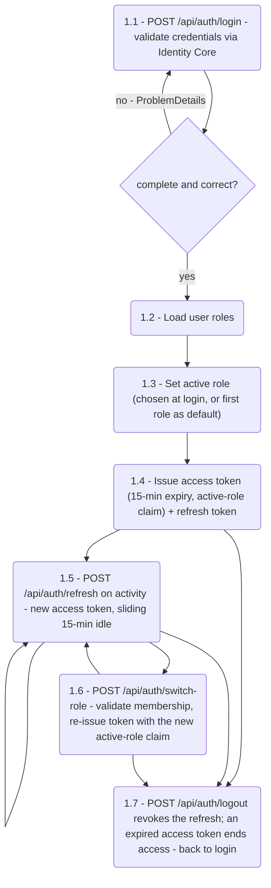
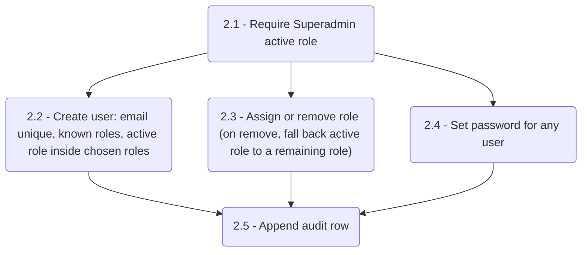
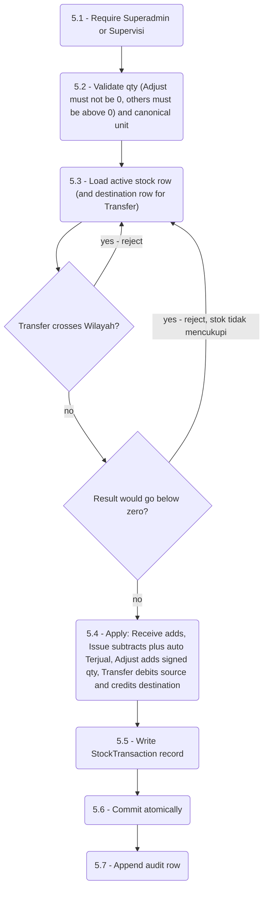
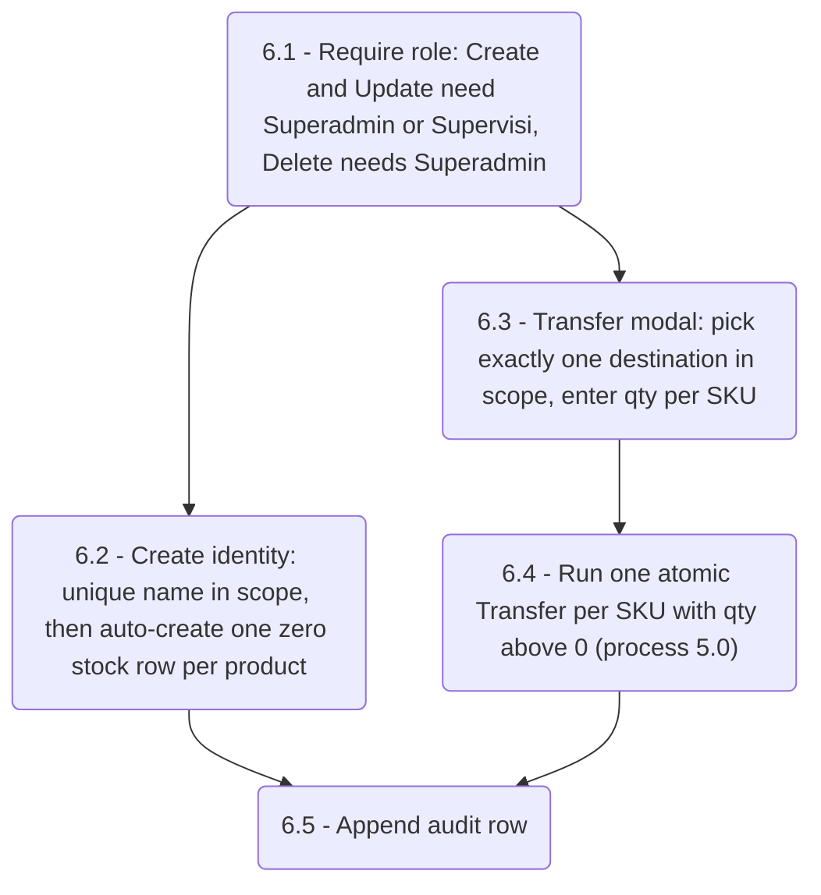
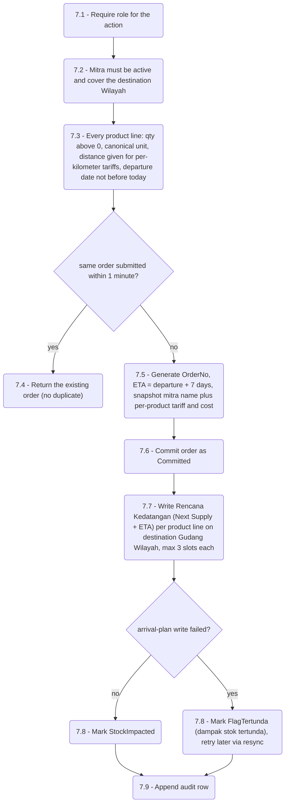
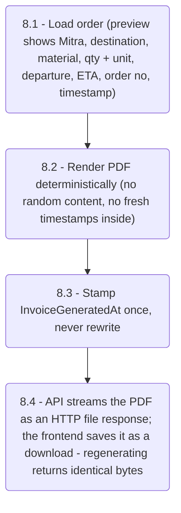
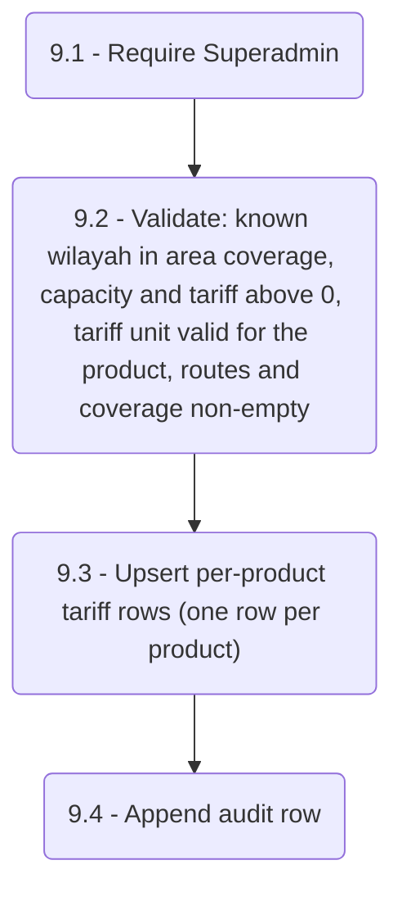

# 04 — DFD Level 2 (Process Explosions)

Each Level 1 process that carries business logic is exploded into numbered steps.
Guards that reject a request are drawn as diamonds; rejection leaves all stores
unchanged.

## 1.0 — Autentikasi dan Sesi (JWT bearer)

## 2.0 — Manajemen User dan Role (Superadmin only)

## 5.0 — Transaksi Stok, Konservasi (Superadmin + Supervisi)

Mid-transfer failure rolls the whole transaction back, so source and destination
never drift apart.

## 6.0 — Inventaris Agen dan Outlet

Scope rules: an Agen must sit under its own Gudang Wilayah; an Outlet must belong to
its own Agen — anything else is rejected. Update Data Harian maps each row to
process 5.0: `Terjual` becomes `Issue`, ticked `Opname` becomes `Adjust`,
`Intransit` and `Keterangan` are stored as metadata.

## 7.0 — Order TSO

Create (Superadmin + Operator). Update (Superadmin + Supervisi). Delete (Superadmin).

Update additionally compares the concurrency token and rejects stale writes
("data telah diperbarui pihak lain, muat ulang"), then re-snapshots tariff and cost.
Delete is a soft delete plus audit. Resync re-runs step 7.7 for `FlagTertunda` orders.

## 8.0 — Draft Invoice

Preview never mutates data; only Submit (process 7.0) commits. If PDF rendering
fails, the committed order is untouched and the user simply retries.

## 9.0 — Manajemen Mitra (Superadmin only)

Tariff changes never rewrite past orders — those keep their own snapshots.
