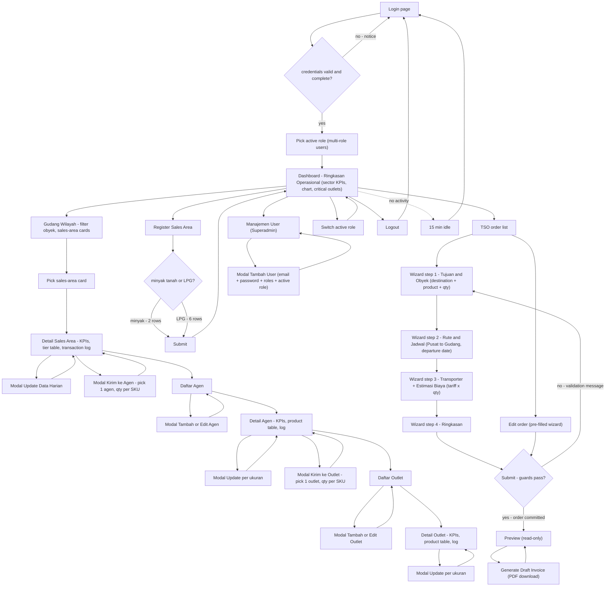

# 05 — Application Flowchart (User Journey)

One diagram for the whole click-path: login, dashboard, every sidebar branch, every
modal, every guard. Diamonds reject and loop back; nothing is lost silently.

## Branch notes

- **Gudang Wilayah:** the LPG card groups all three sizes of one wilayah (pink 5.5kg,
  blue 12kg, orange 50kg chips); the minyak card shows Agen remainder, Outlet
  remainder, sold, in-transit, and notes. Delete is Superadmin-only behind a confirm
  modal and only flags the row deleted — the audit trail stays.
- **Update Data Harian:** one row per size (three for LPG, one for minyak):
  `Terjual` records a sale, ticked `Opname` records a physical-count correction
  (plus or minus), `Intransit` and `Keterangan` are metadata.
- **Kirim ke Agen / Kirim ke Outlet:** runs one atomic transfer per SKU with qty
  above zero. Any SKU exceeding the source balance rejects the whole transfer.
- **TSO wizard:** product choice is a single SKU (one LPG size or minyak tanah).
  Step 3 shows `Estimasi Biaya = tariff × quantity` from the Mitra master.
  Submit commits the order; Preview and Generate never change data.
- **Manajemen User:** Superadmin creates the account with an initial password and
  assigns at least one role plus the starting active role.

## Guard points (diamonds in the diagram)

| Point | Rejection |
|---|---|
| Login | Wrong credentials or empty fields loop back with a notice. |
| Register / Update | Duplicate (Wilayah × Produk × Tier), unknown wilayah/product (400-style error), snapshot date in the future, ETA before snapshot date. |
| Transfers and daily updates | Overdraft ("stok tidak mencukupi"), cross-wilayah or cross-agen destination, non-positive qty (opname must not be 0). |
| TSO Submit | Unregistered mitra, mitra not covering the destination, qty not above zero, departure before today, duplicate submit within 1 minute (returns the existing order instead), arrival slots already full (3), stale edit (concurrency conflict asks for reload). |
| Session | Actions without the required active role are refused with a notice. |
