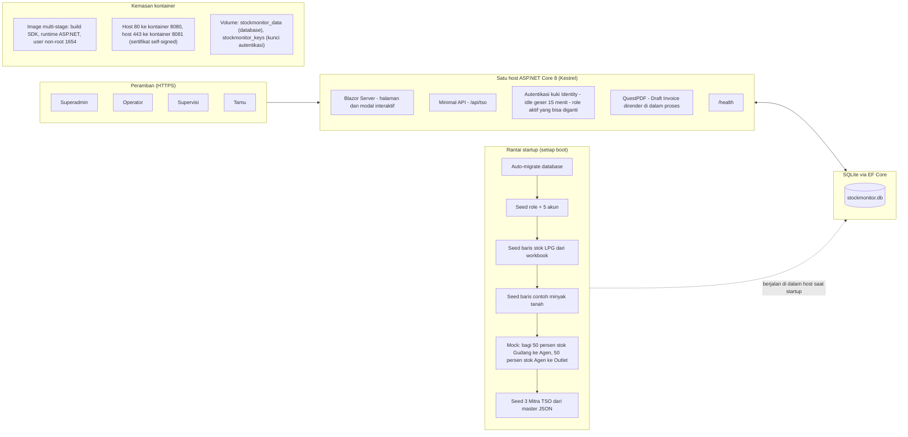
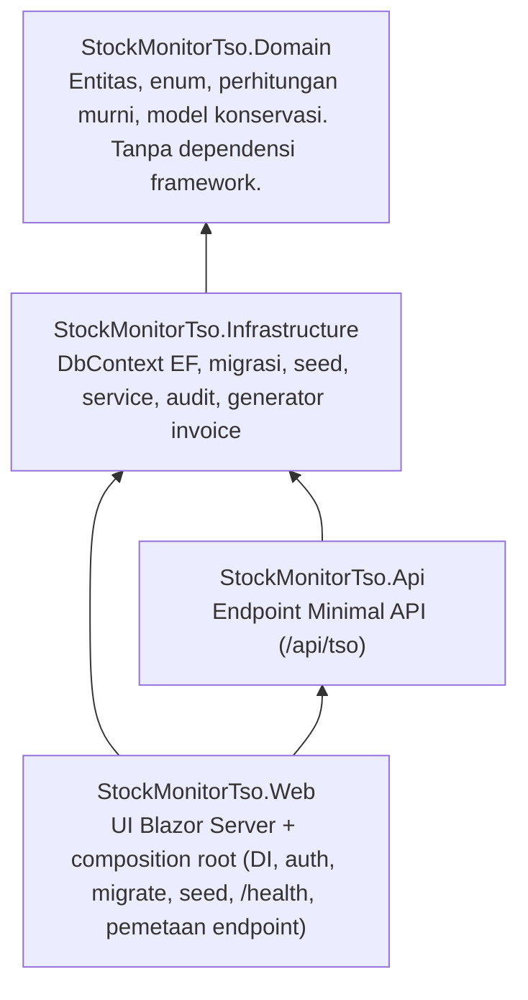

# 01 — Topologi Sistem & Deployment

Aplikasi: **Stock Monitor dan TSO** — satu aplikasi web dengan dua modul yang berbagi
satu shell (login + dashboard): **Monitoring Stok** (minyak tanah + LPG) dan
**Transport Shipping Order (TSO)**.

## 1. Topologi runtime

Catatan:

- Satu Generic Host melayani UI Blazor Server sekaligus Minimal API. Tidak ada layanan
  API terpisah maupun message bus.
- Status autentikasi berupa kuki. Satu-satunya klaim role yang diterbitkan adalah
  **role aktif**; pengguna dengan beberapa role memilih satu role aktif saat login dan
  boleh menggantinya di tengah sesi. Hak akses selalu mengikuti role aktif, bukan
  gabungan seluruh role.
- Generator PDF berjalan di dalam proses; render invoice tidak pernah keluar host.
- Volume kunci khusus dipasang bersama volume data agar kunci autentikasi bisa bertahan
  melewati restart kontainer.
- Tidak ada layanan eksternal yang dipanggil saat runtime. Workbook dan file JSON Mitra
  hanya dibaca **saat seeding startup**; tidak dipantau atau dibaca ulang setelahnya.

## 2. Pelapisan kode

| Lapisan | Memiliki | Aturan |
|---|---|---|
| `StockMonitorTso.Domain` | Entitas (`Wilayah`, `Produk`, `Tier`, `Agen`, `Outlet`, `StokEntitas`, `RencanaKedatangan`, `MitraTso`, `TransportOrder`, `StockTransactionRecord`, `AuditLog`), service perhitungan | Tanpa EF, tanpa ASP.NET. Hanya logika murni. |
| `StockMonitorTso.Infrastructure` | `ApplicationDbContext`, migrasi, seed loader, seluruh service bisnis, generator invoice, audit logger | Semua perubahan stok terjadi di sini dalam transaksi atomik. |
| `StockMonitorTso.Api` | `MapGroup("/api/tso")` | Pemetaan tipis ke service. Tidak boleh berisi logika bisnis. |
| `StockMonitorTso.Web` | Halaman Blazor, layout, `Program.cs` | UI hanya memanggil service. Tidak menghitung atau mengubah stok sendiri. Pengujian UI: `xUnit` + `WebApplicationFactory`, database SQLite sementara. |

## 3. Permukaan jaringan

| Permukaan | Path | Autentikasi | Kegunaan |
|---|---|---|---|
| UI | `/`, `/gudang-wilayah`, `/sales-area/register`, `/sales-area/{Wilayah}/{Produk}`, `/wilayah/{Wilayah}/agen`, `/agen/{AgenId}`, `/agen/{AgenId}/outlet`, `/outlet/{OutletId}`, `/tso`, `/tso/create`, `/tso/{Id}/edit`, `/tso/{Id}`, `/admin/users`, `/Account/*` | Kuki (pengunjung anonim ke halaman login) | Seluruh layar |
| API | `POST /api/tso/`, `GET /api/tso/`, `GET /api/tso/{id}`, `PUT /api/tso/{id}`, `DELETE /api/tso/{id}`, `POST /api/tso/{id}/invoice`, `POST /api/tso/{id}/resync` | Kuki, `RequireAuthorization` | Order TSO sebagai JSON + unduh PDF |
| Health | `/health` | Tidak ada | Probe liveness, health check kontainer |

## 4. Konfigurasi runtime

| Item | Nilai |
|---|---|
| Database | File SQLite (`DataSource=stockmonitor.db`, path lokal saat dev, volume `stockmonitor_data` di kontainer) |
| Perubahan skema | Hanya via migrasi EF Core (`Migrations/`), diterapkan otomatis saat startup |
| Idle timeout | 15 menit, geser (setiap request valid me-reset timer) |
| Akun default (seed, panjang password minimal 8, bisa di-override via konfigurasi) | `superadmin@stockmonitor.local` (Superadmin) · `operator@stockmonitor.local` (Operator) · `supervisi@stockmonitor.local` (Supervisi) · `tamu@stockmonitor.local` (Tamu) · `multi@stockmonitor.local` (Operator + Supervisi + Tamu, mulai sebagai Operator) |
| Penomoran order | `TSO-YYYYMMDD-XXXX`, unik |
| Aturan ETA TSO | Tanggal Keberangkatan + 7 hari |

## 5. Ringkasan alur data

- Peramban mengirim form dan menerima halaman render; Minimal API juga melayani order
  TSO sebagai JSON dan invoice sebagai unduhan file PDF.
- Setiap jalur tulis bermuara ke service di Infrastructure, yang memeriksa role aktif
  dulu, lalu berjalan dalam transaksi EF Core, lalu menulis baris audit.
- Angka stok tidak pernah diedit langsung: `Stok` hanya berubah via `Receive` (masuk),
  `Issue` (terjual, otomatis menambah `StokHabisTerjual`), `Adjust` (opname, plus atau
  minus), atau `Transfer` (debit sumber + kredit tujuan dalam satu transaksi). Setiap
  langkah yang membuat tier menjadi negatif ditolak ("stok tidak mencukupi") dan tidak
  mengubah apa pun.
