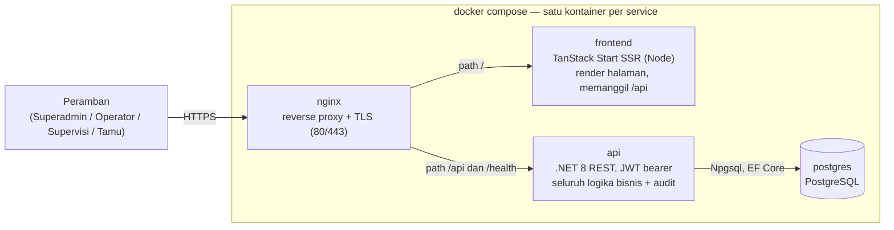
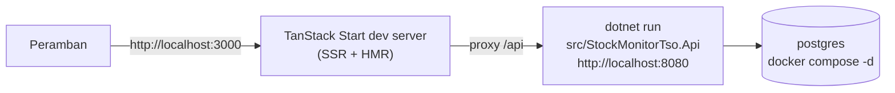

# 01 — Topologi Sistem & Deployment

Aplikasi: **Stock Monitor dan TSO** — dua modul yang berbagi satu shell (login +
dashboard): **Monitoring Stok** (minyak tanah + LPG) dan **Transport Shipping Order
(TSO)**.

> Rekonstruksi 2026-09: satu kontainer per service, monorepo. Aplikasi single-host
> Blazor Server diganti frontend React (TanStack Start, SSR) plus REST API murni
> .NET 8, di atas PostgreSQL, di depan nginx.

## 1. Topologi runtime (produksi — docker compose)

Rantai startup (di dalam kontainer **api**, setiap boot): auto-migrate PostgreSQL →
seed role + 5 akun → seed baris stok (mock atau skip via flag; workbook opsional dan
tidak ada di repo) → mock split: 50% stok Gudang ke Agen, 50% stok Agen ke Outlet
(diaudit sebagai `Transfer`) → upsert 3 Mitra TSO dari master JSON.

Volume & kemasan:

| Kontainer | Sumber image | Catatan |
|---|---|---|
| nginx | image standar + `deploy/nginx/nginx.conf` | Terminasi TLS, routing SPA/SSR, proxy `/api`, proxy `/health` |
| frontend | `frontend/Dockerfile` (node build → node runtime, non-root) | Server SSR TanStack Start; melayani halaman dan aset statis |
| api | `src/StockMonitorTso.Api/Dockerfile` (multi-stage sdk→aspnet, non-root) | Endpoint REST, JWT, QuestPDF di dalam proses, auto-migrate + seed |
| postgres | image standar + `deploy/postgres/init/` | Data di volume `pgdata`; healthcheck sebelum api |

Catatan:

- Autentikasi **stateless**: api menerbitkan token JWT bearer (access 15 menit +
  refresh). Volume kunci sisi server tidak lagi diperlukan untuk sesi.
- nginx tidak pernah menjalankan logika aplikasi; ia hanya routing dan terminasi TLS.
- Tidak ada layanan eksternal lain yang dipanggil saat runtime; master JSON Mitra hanya
  dibaca saat seeding, dan layar Mitra Superadmin mengelolanya setelahnya.

## 2. Alur autentikasi (JWT bearer)

1. `POST /api/auth/login` — email + password (+ role aktif untuk pengguna multi-role)
   → access token (kedaluwarsa 15 menit, klaim role aktif) + refresh token.
2. Setiap panggilan api membawa `Authorization: Bearer <access token>`.
3. `POST /api/auth/refresh` saat ada aktivitas — access token baru; jendela idle
   15 menit bergeser; setelah hangus, pengguna login lagi.
4. `POST /api/auth/switch-role` — keanggotaan divalidasi sisi server, token
   diterbitkan ulang dengan klaim role aktif baru. Tidak pernah client-side saja.
5. `POST /api/auth/logout` — mencabut refresh token; client membuang access token.
6. `GET /api/auth/me` — pengguna saat ini, role, role aktif (bootstrap sesi).

## 3. Topologi dev (tanpa nginx)

## 4. Pelapisan monorepo

| Lapisan | Memiliki | Aturan |
|---|---|---|
| `frontend/` | Halaman TanStack Start, TanStack Router/Query/Form, token Tailwind `sm-*`, interceptor auth | Hanya presentasi. Tanpa logika bisnis; memanggil REST API; menyembunyikan kontrol per role tapi tidak pernah mengandalkan itu sebagai enforcement. |
| `StockMonitorTso.Api` | Endpoint Minimal API (auth, dashboard, stok, agen, outlet, users, tso, mitra), konfigurasi JWT, composition root | Pemetaan tipis ke service; ProblemDetails untuk semua error; role check mencerminkan matriks service. |
| `StockMonitorTso.Domain` | Entitas, enum, perhitungan murni, model konservasi | Tanpa dependensi framework. |
| `StockMonitorTso.Infrastructure` | `DbContext` Npgsql, migrasi, seed, seluruh service bisnis, audit, generator invoice | Semua perubahan stok dalam transaksi atomik di sini. |
| `StockMonitorTso.Web` | Blazor (legasi selama transisi) | Dipensiunkan di R5. |

## 5. Permukaan jaringan

| Rute | Target | Autentikasi | Kegunaan |
|---|---|---|---|
| `/` … | kontainer frontend | tidak ada (shell publik) | Halaman login dan shell aplikasi; route guard kosmetik — API yang menegakkan |
| `/api/auth/*` | api | campuran (login terbuka; lainnya bearer) | login, refresh, logout, me, switch-role |
| `/api/dashboard`, `/api/stock`, `/api/agen`, `/api/outlet` | api | bearer | modul monitoring |
| `/api/tso`, `/api/mitra` | api | bearer | order TSO, invoice (unduh PDF), admin Mitra |
| `/api/users` | api | bearer (Superadmin) | manajemen user + role |
| `/health` | api | tidak ada | liveness; nginx mem-proxy untuk healthcheck compose |

## 6. Konfigurasi

| Item | Nilai |
|---|---|
| Database | PostgreSQL (Npgsql), connection string via env (`ConnectionStrings__DefaultConnection`) |
| JWT | issuer/audience/key via env atau user-secrets — tidak pernah di source |
| Idle timeout | 15 menit, geser (aktivitas memicu refresh) |
| Perubahan skema | Hanya migrasi Npgsql EF Core, diterapkan otomatis saat startup api |
| Penomoran order | `TSO-YYYYMMDD-XXXX`, unik |
| Aturan ETA TSO | Tanggal Keberangkatan + 7 hari |

## 7. Branch

- `main` — **main repository**: set dokumentasi lengkap + seluruh kode.
- `apps` — **production update point**: hanya artefak aplikasi + deploy
  (`src/`, `tests/`, `frontend/`, `deploy/`, `seeds/`, file Docker); dokumentasi tidak
  pernah masuk ke sana.

## 8. Ringkasan alur data

- Peramban hanya berbicara dengan nginx: halaman datang dari frontend SSR, data dari
  REST api (JSON), invoice sebagai unduhan PDF.
- Setiap jalur tulis bermuara ke service Infrastructure: role check (klaim role aktif)
  → transaksi EF → baris audit. Angka stok hanya berubah via `Receive`, `Issue`,
  `Adjust±`, `Transfer` (atomik, overdraft ditolak).
- Bacaan dihitung saat request dari snapshot PostgreSQL (CD, Exhaust Date, Status, MT,
  agregat).
