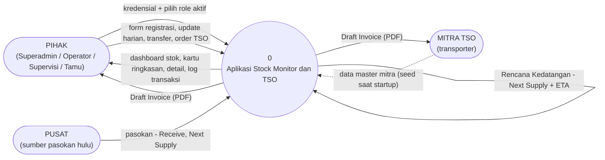

# 02 — DFD Level 0 (Diagram Konteks)

Seluruh aplikasi adalah satu proses (0). Semua yang di luarnya adalah entitas
eksternal. Database berada di dalam sistem dan tidak ditampilkan pada level ini.

## Diagram

## Katalog alur

| # | Dari | Ke | Data | Catatan |
|---|---|---|---|---|
| F1 | Pihak | 0 | Email + password; role aktif pilihan (untuk pengguna multi-role) | Kredensial salah atau tidak lengkap kembali ke halaman login dengan notifikasi. |
| F2 | Pihak | 0 | Form Register Sales Area (baris minyak tanah atau LPG), entri Update Data Harian, permintaan transfer (tujuan + qty per SKU), submit wizard TSO | Setiap alur dijaga oleh role aktif (lihat matriks pada dokumen DFD Level 1). |
| F3 | 0 | Pihak | Dashboard (kartu ringkasan, kartu sales area, chart), tabel detail dengan CD / Exhaust Date / Status / MT terhitung, log transaksi | Akses baca terbuka untuk keempat role. |
| F4 | 0 | Pihak, Mitra | Draft Invoice PDF (Mitra, Gudang Wilayah tujuan, material, kuantitas + satuan, tanggal keberangkatan, ETA, nomor order, timestamp generate) | Generate PDF tidak mengubah apa pun; generate ulang order yang sama menghasilkan output identik secara byte. |
| F5 | Mitra (master) | 0 | Identitas mitra, kendaraan, kapasitas, rute, area coverage, kontak, tarif | Dimuat sekali saat startup dari file JSON; setelahnya menjadi data master read-only. |
| F6 | Pusat | 0 | Pasokan masuk dicatat sebagai `Receive`, plus pasokan masa depan dicatat sebagai rencana kedatangan | Saldo stok pusat tidak dilacak; hanya kuantitas di atas nol yang ditegakkan. |
| F7 | 0 | (internal) | `Rencana Kedatangan` (Next Supply + ETA, hingga 3 slot per baris stok) pada Gudang Wilayah tujuan | Dibuat saat order TSO ter-commit; bila gagal dibuat, order ditandai "dampak stok tertunda" dan disinkronkan belakangan. |

## Batas sistem

**Di dalam proses 0:** autentikasi dan sesi, manajemen role, perhitungan stok,
registrasi dan update stok, transaksi stok atomik, inventaris Agen/Outlet dan
transfer, order TSO, generate invoice, audit log, database SQLite.

**Di luar:** empat role manusia (dikelompokkan sebagai satu entitas eksternal karena
semuanya memakai layar yang sama dengan izin berbeda), perusahaan transporter yang
terdaftar di master Mitra, dan titik pasokan hulu (Pusat) yang mengirim ke Gudang
Wilayah. Konsumen akhir (masyarakat) di luar scope — tidak pernah menyentuh sistem.
