# 03 — DFD Level 1 (Proses + Data Store)

Proses 0 dari Level 0 diurai menjadi 8 proses dan 7 data store.
`PIHAK`, `MITRA`, dan `PUSAT` adalah entitas eksternal dari Level 0.

## Diagram

```mermaid
flowchart TB
    PIHAK(["PIHAK"])
    MITRA(["MITRA TSO"])
    PUSAT(["PUSAT"])

    subgraph PROCS["Proses"]
        P1("1.0<br/>Autentikasi dan Sesi")
        P2("2.0<br/>Manajemen User dan Role")
        P3("3.0<br/>Pemantauan Stok")
        P4("4.0<br/>Registrasi dan Update Data Stok")
        P5("5.0<br/>Transaksi Stok (Konservasi)")
        P6("6.0<br/>Inventaris Agen dan Outlet")
        P7("7.0<br/>Order TSO")
        P8("8.0<br/>Draft Invoice")
    end

    subgraph STORES["Data store"]
        D1[("D1 - Identity")]
        D2[("D2 - StokEntitas + RencanaKedatangan")]
        D3[("D3 - Agen + Outlet")]
        D4[("D4 - MitraTso")]
        D5[("D5 - TransportOrder")]
        D6[("D6 - StockTransactions")]
        D7[("D7 - AuditLogs")]
    end

    PIHAK -->|"kredensial, pilih role, ganti role, logout"| P1
    P1 <-->|"user, role, role aktif"| D1
    P1 -->|"sesi + klaim role aktif"| PIHAK

    PIHAK -->|"buat user, assign role, ganti password (Superadmin)"| P2
    P2 <-->|"user, role"| D1
    P2 -->|"audit"| D7

    PIHAK -->|"filter wilayah dan obyek"| P3
    P3 -->|"baca stok, agen, outlet"| D2
    P3 -->|"baca identitas"| D3
    P3 -->|"ringkasan, kartu, tabel, log"| PIHAK

    PIHAK -->|"registrasi, update detail, hapus"| P4
    P4 -->|"tulis baris stok"| D2
    P4 -->|"audit"| D7

    PIHAK -->|"Receive, Issue, Adjust, Transfer"| P5
    PUSAT -->|"pasokan"| P5
    P5 <-->|"debit dan kredit atomik"| D2
    P5 -->|"catat mutasi"| D6
    P5 -->|"audit"| D7
    P5 -->|"stok baru, log"| PIHAK

    PIHAK -->|"buat, ubah, hapus agen dan outlet; kirim ke agen, kirim ke outlet"| P6
    P6 <-->|"identitas + baris stok per produk"| D3
    P6 -->|"transfer antar-tier"| P5
    P6 -->|"audit"| D7

    PIHAK -->|"buat, ubah, hapus order; resync"| P7
    P7 -->|"baca master mitra"| D4
    P7 -->|"tulis order"| D5
    P7 -->|"tulis Next Supply + ETA gudang tujuan"| D2
    P7 -->|"audit"| D7
    P7 -->|"order ter-commit"| PIHAK

    PIHAK -->|"preview, generate PDF"| P8
    P8 -->|"baca order"| D5
    P8 -->|"baca mitra"| D4
    P8 -->|"Draft Invoice PDF"| PIHAK
    P8 -->|"Draft Invoice PDF"| MITRA
```

## Tabel proses

| # | Proses | Masuk | Keluar | Yang boleh mengubah |
|---|---|---|---|---|
| 1.0 | Autentikasi dan Sesi — login, pilih role aktif, ganti role di tengah sesi, idle geser 15 menit, logout eksplisit | Kredensial, pilihan role | Kuki sesi yang hanya membawa role aktif | — (sistem) |
| 2.0 | Manajemen User dan Role — buat user (email + password + role + role aktif eksplisit), assign/hapus role, ganti password | Form admin | User/role diperbarui, baris audit | Hanya Superadmin |
| 3.0 | Pemantauan Stok — kartu ringkasan, kartu sales area (LPG digabung 1 kartu per wilayah dengan 3 chip ukuran), tabel detail, log transaksi | Filter | CD / Exhaust Date / Status / MT terhitung, agregat | Baca: semua role |
| 4.0 | Registrasi dan Update Data Stok — Register Sales Area (bercabang minyak 2 baris vs LPG 6 baris), update detail (pre-filled), hapus lunak dengan modal konfirmasi | Form | Baris stok dibuat/diubah/ditandai hapus, baris audit | Registrasi: Superadmin + Operator · Update: Superadmin + Supervisi · Hapus: Superadmin |
| 5.0 | Transaksi Stok (Konservasi) — satu-satunya penulis `Stok`, selalu dalam satu transaksi DB | `Receive` / `Issue` / `Adjust` / `Transfer` + qty + tujuan opsional | Saldo berubah, record transaksi, baris audit | Superadmin + Supervisi (Receive juga via jalur registrasi 4.0: Superadmin + Operator) |
| 6.0 | Inventaris Agen dan Outlet — CRUD identitas bernama (otomatis membuat baris stok nol per produk), modal "Kirim ke Agen" dan "Kirim ke Outlet" (satu tujuan + qty per SKU, satu `Transfer` atomik per SKU) | Form identitas, permintaan transfer | Baris identitas, baris stok, baris audit | Buat/Ubah identitas: Superadmin + Supervisi · Hapus identitas: Superadmin |
| 7.0 | Order TSO — wizard 4 langkah, commit saat Submit, penjaga duplikat 1 menit, snapshot harga, dampak rencana kedatangan | Payload wizard (tujuan, rute, tanggal, mitra, produk, qty) | Order ter-commit, rencana kedatangan pada Gudang Wilayah tujuan, baris audit | Buat: Superadmin + Operator · Ubah: Superadmin + Supervisi · Hapus: Superadmin |
| 8.0 | Draft Invoice — preview read-only + generate PDF deterministik | Id order | Byte PDF (identik bila di-generate ulang) | Role yang berhak melihat order |

Setiap mutasi di 2.0 dan 4.0–7.0 menambah ke **D7 AuditLogs** (pelaku, role aktif,
waktu, entitas, nilai sebelum/sesudah).

## Tabel data store

| Store | Berisi | Aturan kunci |
|---|---|---|
| D1 Identity | User, role, relasi user-role, `ActiveRoleName` | Assign role dan ganti password hanya Superadmin, ditegakkan di lapisan service. |
| D2 StokEntitas + RencanaKedatangan | Satu baris per (Wilayah × Produk × Tier); baris Agen membawa `AgenId`, baris Outlet membawa `OutletId`; hingga 3 slot kedatangan per baris | Index unik terfilter per bentuk baris. Hanya ditulis oleh 4.0, 5.0, dan 7.0. |
| D3 Agen + Outlet | Identitas bernama (`Agen`: nama unik per Wilayah, 2–3 per Gudang; `Outlet`: nama unik per Agen, 2 per Agen) | Soft delete; baris stok mereferensikannya. |
| D4 MitraTso | Master transporter: id, nama, kendaraan, kapasitas, rute, area coverage, kontak, PIC, tarif | Dimuat saat startup, read-only setelahnya. |
| D5 TransportOrder | Header order: nomor order, mitra + snapshot nama, snapshot tarif + biaya, tujuan, rute, produk, qty + satuan, keberangkatan, ETA, status (`Committed` / `StockImpacted` / `FlagTertunda`), token konkurensi | Soft delete; snapshot harga membekukan order dari perubahan tarif di kemudian hari. |
| D6 StockTransactions | Satu baris per mutasi (sebelum/sesudah sumber; sebelum/sesudah tujuan untuk transfer) | Append-only. |
| D7 AuditLogs | Siapa berbuat apa, dengan role aktif apa, kapan, sebelum/sesudah | Append-only. |

## Aturan yang berlaku di dalam proses

**Perhitungan (3.0):** `CD = Stok ÷ DOT` (kosong "N/A" bila DOT 0) ·
`Exhaust Date = Tanggal Stok Awal + CD` · Status: Kritis bila CD < 3, Warning bila
3 ≤ CD < 7, Aman bila CD ≥ 7 · Setelah rencana kedatangan ke-n:
`CD_n = (sisa stok saat ETA_n + Next Supply_n) ÷ DOT`,
`Exhaust_n = ETA_n + CD_n` · Khusus LPG: `MT = Tabung × berat ukuran ÷ 1000`.

**Satuan (4.0, 5.0, 7.0):** LPG dihitung dalam Tabung, minyak tanah dalam Kiloliter;
satuan campur ditolak.

**Konservasi (5.0):** `Receive` menambah · `Issue` mengurangi dan otomatis menambah
qty yang sama ke `StokHabisTerjual` · `Adjust` menambah qty bertanda (opname, tidak
boleh 0) · `Transfer` mendebit sumber dan mengkredit tujuan dalam satu transaksi,
hanya se-Wilayah. Setiap jalur yang membuat tier menjadi negatif ditolak ("stok tidak
mencukupi") dan tidak mengubah apa pun.

**Waktu distribusi:** Leg Gudang Wilayah → Agen → Outlet bersifat same-day
(tanggal permintaan = tanggal tiba). Leg Pusat → Gudang Wilayah (7.0) memiliki lead
time variabel; ETA adalah estimasi (keberangkatan + 7 hari), dan kedatangan yang
terlewat ditandai "Terlambat".
