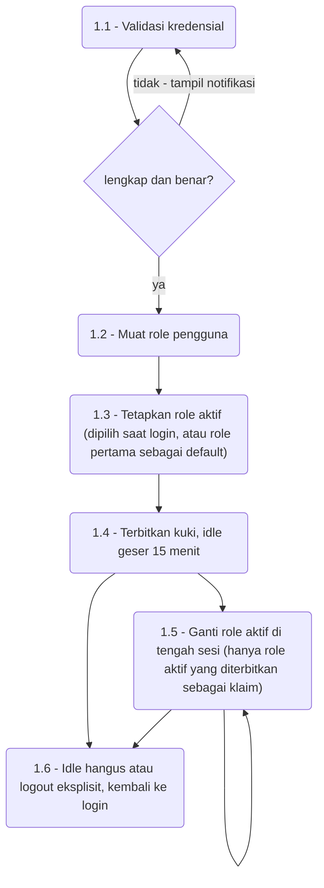
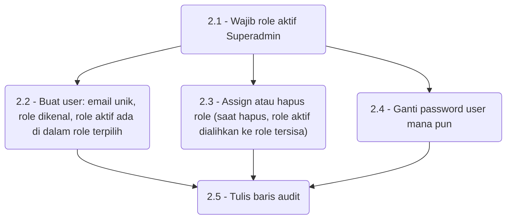
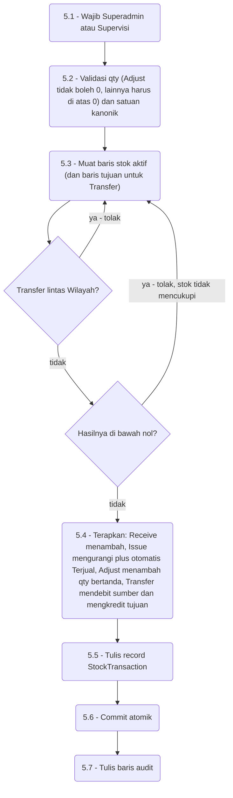
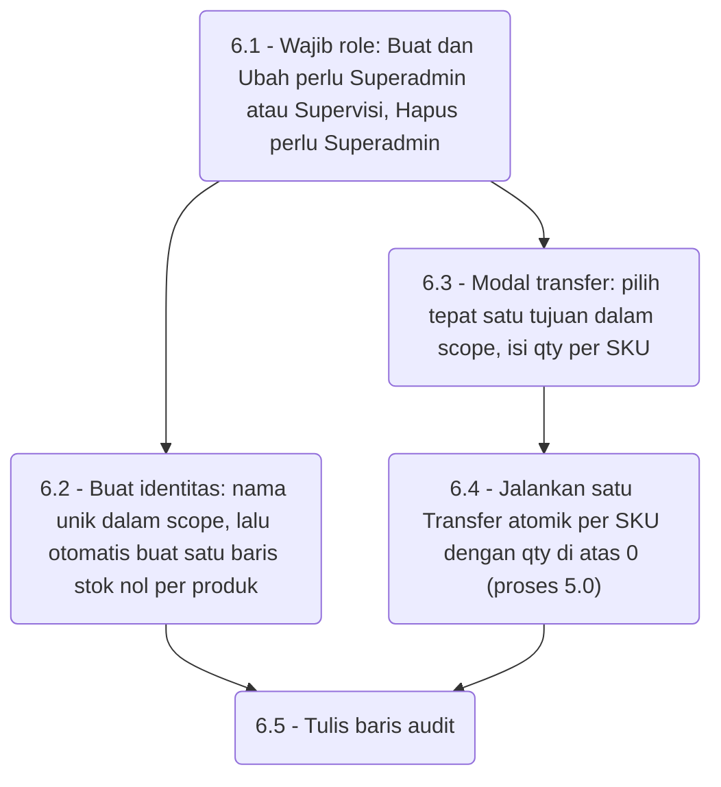
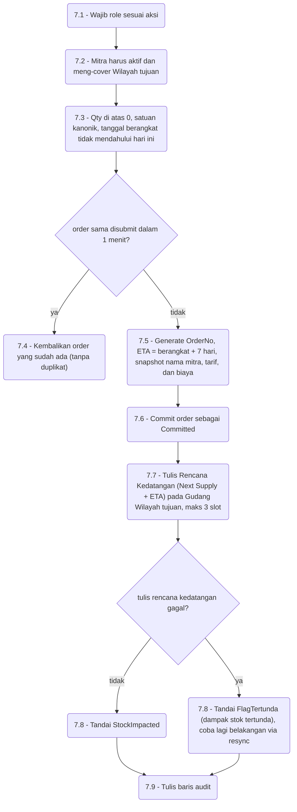
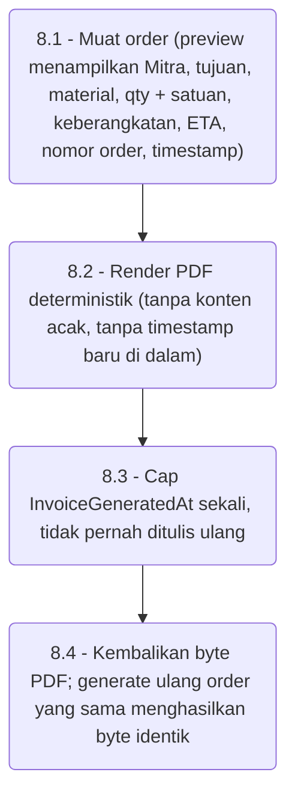

# 04 — DFD Level 2 (Uraian Proses)

Setiap proses Level 1 yang membawa logika bisnis diurai menjadi langkah bernomor.
Penjaga yang menolak request digambar sebagai belah ketupat; penolakan tidak mengubah
isi store mana pun.

## 1.0 — Autentikasi dan Sesi

## 2.0 — Manajemen User dan Role (hanya Superadmin)

## 5.0 — Transaksi Stok, Konservasi (Superadmin + Supervisi)

Kegagalan di tengah transfer me-rollback seluruh transaksi, sehingga sumber dan
tujuan tidak pernah selisih.

## 6.0 — Inventaris Agen dan Outlet

Aturan scope: Agen harus berada di bawah Gudang Wilayah-nya sendiri; Outlet harus
milik Agen-nya sendiri — selain itu ditolak. Update Data Harian memetakan tiap baris
ke proses 5.0: `Terjual` menjadi `Issue`, `Opname` yang dicentang menjadi `Adjust`,
`Intransit` dan `Keterangan` disimpan sebagai metadata.

## 7.0 — Order TSO

Buat (Superadmin + Operator). Ubah (Superadmin + Supervisi). Hapus (Superadmin).

Ubah juga membandingkan token konkurensi dan menolak tulisan basi ("data telah
diperbarui pihak lain, muat ulang"), lalu menghitung ulang snapshot tarif dan biaya.
Hapus adalah soft delete plus audit. Resync mengulang langkah 7.7 untuk order
`FlagTertunda`.

## 8.0 — Draft Invoice

Preview tidak pernah mengubah data; hanya Submit (proses 7.0) yang commit. Bila render
PDF gagal, order yang sudah ter-commit tidak tersentuh dan pengguna tinggal mencoba
lagi.
