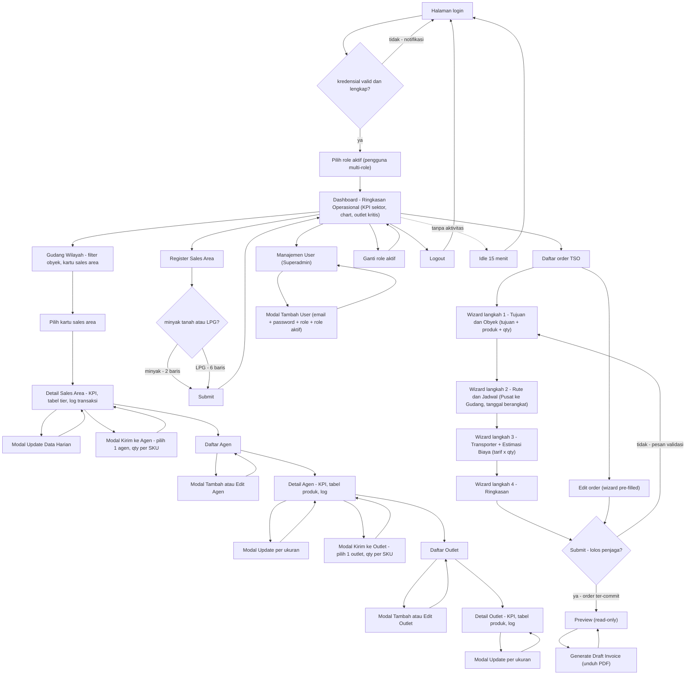

# 05 — Diagram Alir Aplikasi (Perjalanan Pengguna)

Satu diagram untuk seluruh jalur klik: login, dashboard, setiap cabang sidebar, setiap
modal, setiap penjaga. Belah ketupat menolak dan kembali; tidak ada yang hilang diam-diam.

## Catatan cabang

- **Gudang Wilayah:** kartu LPG mengelompokkan ketiga ukuran satu wilayah (chip pink
  5.5kg, biru 12kg, oranye 50kg); kartu minyak menampilkan sisa Agen, sisa Outlet,
  terjual, intransit, dan keterangan. Hapus hanya Superadmin di balik modal konfirmasi
  dan hanya menandai baris terhapus — jejak audit tetap ada.
- **Update Data Harian:** satu baris per ukuran (tiga untuk LPG, satu untuk minyak):
  `Terjual` mencatat penjualan, `Opname` yang dicentang mencatat koreksi hitung fisik
  (plus atau minus), `Intransit` dan `Keterangan` disimpan sebagai metadata.
- **Kirim ke Agen / Kirim ke Outlet:** menjalankan satu transfer atomik per SKU dengan
  qty di atas nol. SKU mana pun yang melebihi saldo sumber menggagalkan seluruh transfer.
- **Wizard TSO:** pilihan produk adalah satu SKU (satu ukuran LPG atau minyak tanah).
  Langkah 3 menampilkan `Estimasi Biaya = tarif × kuantitas` dari master Mitra.
  Submit meng-commit order; Preview dan Generate tidak mengubah data.
- **Manajemen User:** Superadmin membuat akun dengan password awal serta minimal satu
  role plus role aktif awal.

## Titik penjaga (belah ketupat pada diagram)

| Titik | Penolakan |
|---|---|
| Login | Kredensial salah atau field kosong kembali dengan notifikasi. |
| Registrasi / Update | Duplikat (Wilayah × Produk × Tier), wilayah/produk tak dikenal (error 400), tanggal snapshot di masa depan, ETA mendahului tanggal snapshot. |
| Transfer dan update harian | Overdraft ("stok tidak mencukupi"), tujuan lintas wilayah atau lintas agen, qty tidak positif (opname tidak boleh 0). |
| Submit TSO | Mitra tak terdaftar, mitra tidak meng-cover tujuan, qty tidak di atas nol, berangkat mendahului hari ini, submit ganda dalam 1 menit (mengembalikan order yang sudah ada), slot kedatangan sudah penuh (3), edit basi (konflik konkurensi diminta reload). |
| Sesi | Aksi tanpa role aktif yang berwenang ditolak dengan notifikasi. |
