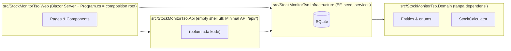
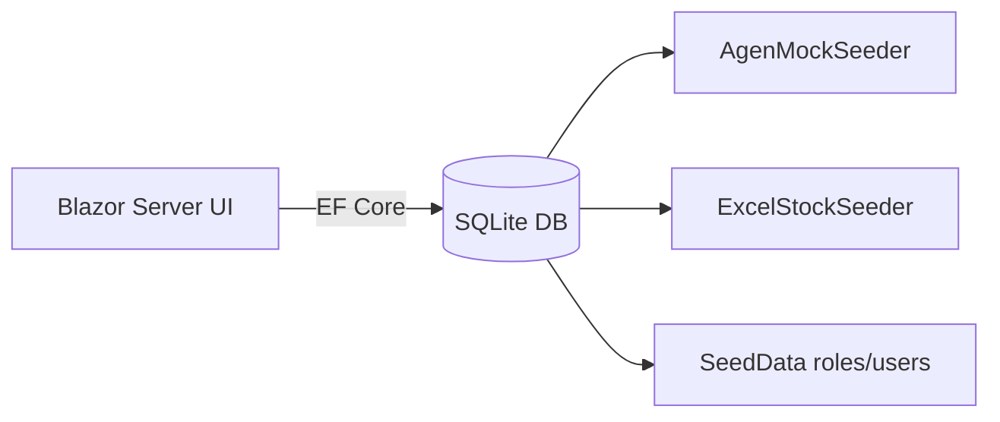
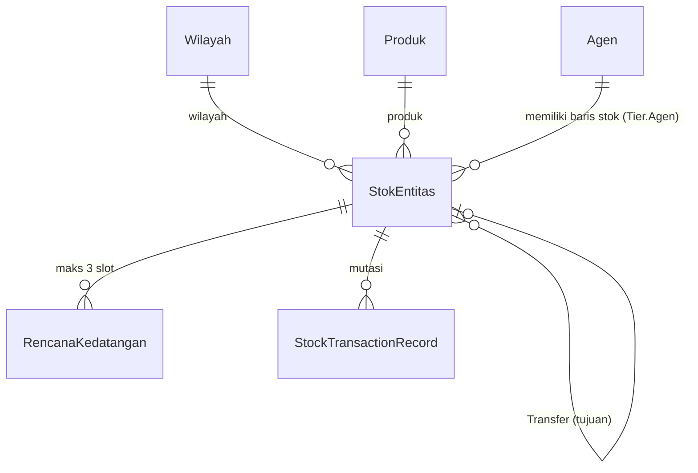
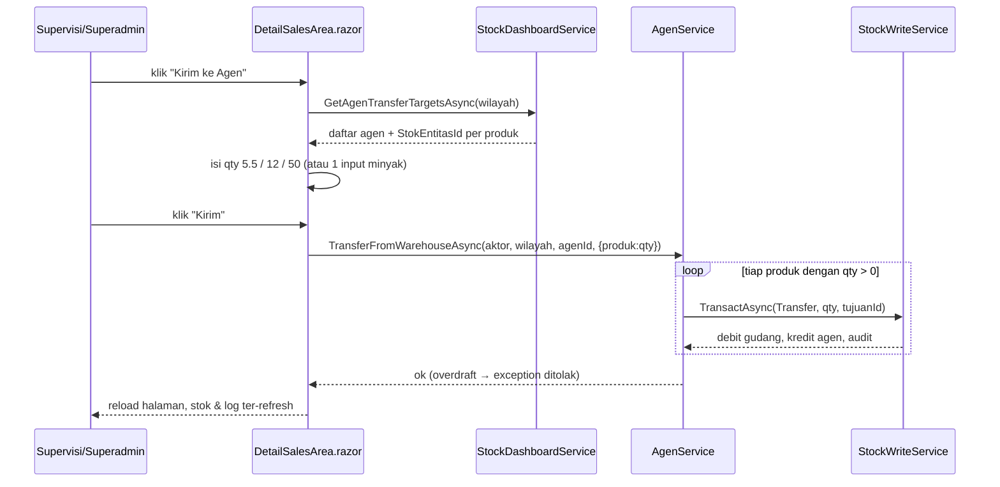
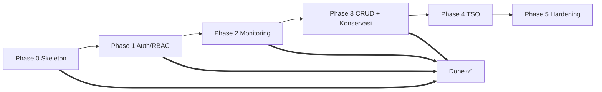

# Developer Guide — Aplikasi Stock Monitor dan TSO

> Panduan orientasi kode untuk programmer yang baru bergabung. Tujuannya: cepat membaca,
> mengerti, dan mengembangkan aplikasi ini. Bukan pengganti spec/plan — melainkan peta
> "di mana kodenya, bagaimana mengalir, bagaimana menambah fitur".
>
> Bacaan wajib pendamping (source of truth):
> `PLAN.md` (roadmap & guardrails) · `STOCK_MONITORING_SPEC.md` · `TRANSPORT_SHIPPING_ORDER_SPEC.md`
> · `AGENTS.md` (persona & traps) · `docs/SESSION_HANDOFF.md` (status terkini) · `docs/UI_REFERENCE.md` (style).

---

## Daftar Isi
1. [Cara cepat jalan](#1-cara-cepat-jalan)
2. [Arsitektur & struktur solusi](#2-arsitektur--struktur-solusi)
3. [Model domain & alur data](#3-model-domain--alur-data)
4. [Auth & RBAC](#4-auth--rbac)
5. [Peta kode](#5-peta-kode)
6. [Alur bisnis utama (walkthrough)](#6-alur-bisnis-utama-walkthrough)
7. [Database & migrasi](#7-database--migrasi)
8. [UI Blazor Server](#8-ui-blazor-server)
9. [Testing](#9-testing)
10. [Konvensi & gotchas](#10-konvensi--gotchas)
11. [Peta pengembangan](#11-peta-pengembangan)
12. [Referensi silang dokumen](#12-referensi-silang-dokumen)

---

## 1. Cara cepat jalan

Prasyarat: **.NET 8 SDK**. Proyek memakai `TreatWarningsAsErrors` (peringatan = error).

```bash
# dari root repo
dotnet build StockMonitorTso.sln -warnaserror     # build, 0 warning/error
dotnet run --project src/StockMonitorTso.Web --launch-profile http   # http://localhost:5110

# mode pengembangan dengan auto-reload (disarankan):
dotnet watch run --project src/StockMonitorTso.Web --launch-profile http
```

**Akun seed** (dibuat otomatis saat startup; bisa di-override via config `Seed:*`):

| Akun | Email | Password | Role |
|---|---|---|---|
| Superadmin | `superadmin@stockmonitor.local` | `Superadmin!2345` | Superadmin |
| Operator | `operator@stockmonitor.local` | `Operator!2345` | Operator |
| Supervisi | `supervisi@stockmonitor.local` | `Supervisi!2345` | Supervisi |
| Tamu | `tamu@stockmonitor.local` | `Tamu!2345` | Tamu |
| Multi-role | `multi@stockmonitor.local` | `MultiRole!2345` | Operator + Supervisi + Tamu (role aktif awal: Operator) |

**Gerbang verifikasi (wajib sebelum commit):**

```bash
dotnet build StockMonitorTso.sln -warnaserror
dotnet test StockMonitorTso.sln
dotnet format StockMonitorTso.sln --verify-no-changes
```

**Hot reload:** perubahan `.razor`/body C# kadang bisa hot reload via `dotnet watch`; perubahan yang
menambah field/signature/method baru, mengubah DI/service, atau layout **harus restart penuh**.
Jika tombol/fitur baru tidak muncul, kemungkinan server belum di-rebuild — restart dulu.

---

## 2. Arsitektur & struktur solusi

Satu deployable: **Blazor Server** (UI) + (rencana) **Minimal API** `/api/*` dibungkus dalam satu host.





### Peran tiap proyek

| Proyek | Peran | Dependensi |
|---|---|---|
| `StockMonitorTso.Domain` | Entitas, enum, perhitungan murni (`StockCalculator`), abstraksi (mis. `IAuditLogService`). **Tanpa EF/ASP.NET.** | — |
| `StockMonitorTso.Infrastructure` | `ApplicationDbContext`, migrasi, seed, service CRUD/stok/dashboard/audit/user-admin, claims factory. | Domain |
| `StockMonitorTso.Api` | Shell untuk Minimal API `/api/*` (MapGroup per resource). Saat ini **belum ada file .cs** — dipakai TSO nanti. | Domain, Infra (+ `Microsoft.AspNetCore.App`) |
| `StockMonitorTso.Web` | Blazor Server UI + `Program.cs` (wiring DI, auth, auto-migrate+seed). | Infra, Domain, Api |

### Komposisi root (`Web/Program.cs`)

- `AddRazorComponents().AddInteractiveServerComponents()` — Blazor Server.
- Identity cookie: **idle 15 menit sliding** (`ExpireTimeSpan=15m`, `SlidingExpiration`).
- EF Core + SQLite (`ConnectionStrings:DefaultConnection`).
- DI service (scoped): `IAuditLogService`, `IUserAdminService`, `IAgenService`,
  `IStockDashboardService`, `IStockWriteService`, `ActiveRoleClaimsPrincipalFactory`.
- Startup: `db.Database.Migrate()` → `SeedData.SeedAsync(...)` (role, user, stok, agen mock).
- `MapHealthChecks("/health")`, `MapRazorComponents<App>()`, `MapAdditionalIdentityEndpoints()`.

---

## 3. Model domain & alur data

### Entitas (Domain/Entities)



- **`Wilayah`** (enum, 7): Maluku, Papua Barat, Papua Barat Daya, Maluku Utara, Papua Tengah,
  Papua Selatan-Pegunungan, Papua. `WilayahInfo.All` = urutan kanonik.
- **`Produk`** (enum): `Lpg5_5Kg`, `Lpg12Kg`, `Lpg50Kg`, `MinyakTanah`.
- **`Tier`** (enum): `GudangWilayah`, `Agen`, `Outlet` — **urutan enum mengikuti hirarki distribusi**
  `Pusat → Gudang Wilayah → Agen → Outlet` (sortir default naik).
- **`Agen`**: identitas agen bernama; `Nama` unik case-insensitive per `Wilayah`; soft delete `IsDeleted`.
- **`StokEntitas`**: baris stok.
  - Gudang Wilayah / Outlet → granularitas **(Wilayah × Produk × Tier)**, `AgenId = null`.
  - Agen → granularitas **(Agen × Produk)**, `Tier = Agen` + `AgenId` terisi.
  - Kolom: `Stok`, `DOT`, `TanggalStokAwal`, `StokHabisTerjual?`/`StokIntransit?` (khusus minyak),
    `Keterangan`, `IsDeleted`.
- **`RencanaKedatangan`**: Next Supply + ETA, `Urutan` 1–3 per entitas.
- **`StockTransactionRecord`**: jejak mutasi debit/kredit; transfer mencatat sumber+tujuan dalam satu baris.
- **`AuditLog`**: append-only untuk semua aksi mutasi (pihak, role aktif, sebelum/sesudah).

### Granularitas & uniqueness (ApplicationDbContext)

Dua **filtered unique index** di `StokEntitas` agar aturan berbeda per bentuk baris:

```csharp
// Gudang/Outlet: unik per (Wilayah, Produk, Tier) saat baris tidak milik agen
HasIndex(e => new { e.Wilayah, e.Produk, e.Tier }).IsUnique().HasFilter("[AgenId] IS NULL");
// Agen: unik per (AgenId, Produk, Tier)
HasIndex(e => new { e.AgenId, e.Produk, e.Tier }).IsUnique().HasFilter("[AgenId] IS NOT NULL");
```

### Rumus (Domain/Services/StockCalculator.cs)

| Metrik | Rumus |
|---|---|
| CD / Coverage Days | `Stok ÷ DOT` — null bila DOT ≤ 0 (F3 → tampil "N/A") |
| Exhaust Date | `TanggalStokAwal + CD` |
| CD setelah Rencana ke-n | `(Sisa stok saat ETA_n + Next Supply_n) ÷ DOT` |
| Status | Kritis `CD < 3` · Warning `3 ≤ CD < 7` · Aman `CD ≥ 7` |
| MT (LPG) | `Tabung × berat ukuran ÷ 1000` |
| MT null | untuk Minyak Tanah |

> ⚠️ **Larangan keras:** JANGAN meniru rumus `CD_n` pada Excel acuan (`Next Supply ÷ Σ CD`) —
> salah dimensi. Rumus konseptual yang benar ada di `StockCalculator.CoverageDaysAfterRencana`.

### Konservasi stok (paling penting)

Angka stok **tidak pernah diedit langsung**. Semua mutasi lewat `IStockWriteService.TransactAsync`
yang atomik (transaction `BeginTransactionAsync`):

- **`Receive`** → tambah stok (+).
- **`Adjust`** → koreksi (+; **qty harus > 0**; kuantitas negatif **ditolak** — lihat "Stok Terjual" open decision §11).
- **`Transfer`** → debit sumber + kredit tujuan (dalam satu transaksi), hanya **antar-tier se-wilayah**.
- **Overdraft ditolak (G3/F4)** — `EnsureSufficientStock(entity, entity.Stok - kuantitas)`.
- Tiap mutasi tercatat di `StockTransactions` + `AuditLog`.

---

## 4. Auth & RBAC

- **ASP.NET Core Identity** (cookie). Multi-role user via many-to-many.
- **Switchable active role**: `ActiveRoleClaimsPrincipalFactory` membuang seluruh klaim role lalu
  menambahkan **hanya role aktif** (`ApplicationUser.ActiveRoleName`). Jadi hak akses selalu mengikuti
  role yang sedang aktif, bukan gabungan. Render via `ActiveRoleSwitcher` di sidebar.
- **Idle 15 menit** (sliding cookie) + logout eksplisit.
- **Manajemen pengguna** (`IUserAdminService`): assign/remove role & set password **Superadmin only**
  (dicek di service layer, bukan cuma UI); semua action di-audit.

### Matriks role per aksi

| Aksi | Superadmin | Operator | Supervisi | Tamu |
|---|---|---|---|---|
| Baca dashboard/detail | ✅ | ✅ | ✅ | ✅ |
| Register entitas stok (Sales Area) | ✅ | ✅ | ❌ | ❌ |
| Update detail stok / isi ulang | ✅ | ❌ | ✅ | ❌ |
| **Identitas Agen**: Create/Update | ✅ | ❌ | ✅ | ❌ |
| **Identitas Agen**: Delete | ✅ | ❌ | ❌ | ❌ |
| Transfer Gudang → Agen | ✅ | ❌ | ✅ | ❌ |
| Delete entitas stok | ✅ | ❌ | ❌ | ❌ |
| Assign role / ganti password | ✅ | ❌ | ❌ | ❌ |

> Catatan: Create identitas **Agen = Superadmin + Supervisi** (amend spec 2026-08); Create stok tetap
> Superadmin + Operator. Enforce terjadi di service (`RequireAnyRole`) **dan** UI (`AuthorizeView`).

---

## 5. Peta kode

```
src/StockMonitorTso.Domain/
  Entities/{Wilayah, Produk, Tier, Agen, StokEntitas, RencanaKedatangan,
            StockTransaction, StockTransactionRecord, AuditLog}.cs
  Services/StockCalculator.cs          ← rumus CD/Exhaust/Status/MT/CD_n
  Abstractions/IAuditLogService.cs

src/StockMonitorTso.Infrastructure/
  Persistence/ApplicationDbContext.cs  ← EF config + filtered index
  Persistence/ApplicationUser.cs
  Persistence/Migrations/              ← 5 migrasi (SQLite)
  Seed/SeedData.cs                     ← roles, users, panggil seed stok + agen
  Seed/ExcelStockSeeder.cs             ← LPG dari xlsx (sheet Agen→GudangWilayah, Outlet)
  Seed/AgenMockSeeder.cs               ← 2–3 agen/wilayah, split 50%, DOT bagi rata
  Excel/XlsxReader.cs                  ← parser xlsx stdlib (unzip + sharedStrings)
  Services/
    StockWriteService.cs               ← Register/UpdateDetail/Transact/Delete (konservasi)
    StockDashboardService.cs           ← agregasi dashboard, cards, detail, agen inventaris
    AgenService.cs                     ← CRUD agen + TransferFromWarehouseAsync
    AuditLogService.cs                 ← tulis AuditLog
    UserAdminService.cs                ← assign role / password (Superadmin only)
    ActiveRoleClaimsPrincipalFactory.cs← klaim role aktif saja

src/StockMonitorTso.Web/
  Program.cs                           ← composition root (DI, auth, migrate, seed, health)
  Components/Layout/{MainLayout, NavMenu, ActiveRoleSwitcher}.razor
  Components/Pages/
    Home.razor                     "/"                                   Ringkasan Operasional
    GudangWilayah.razor            "/gudang-wilayah"                     kartu sales area (LPG 1 card/wilayah)
    RegisterSalesArea.razor        "/sales-area/register"                (Superadmin+Operator)
    DetailSalesArea.razor          "/sales-area/{Wilayah}/{Produk}"      detail + modal transfer & update
    DaftarAgen.razor               "/wilayah/{Wilayah}/agen"             daftar agen + CRUD
    DetailAgen.razor               "/agen/{AgenId:int}"                  detail agen + update
    Admin/UserManagement.razor     "/admin/users"                        (Superadmin only)
```

**Kunci:** jangan menambah logika stok di UI. UI hanya memanggil service (`IStockWriteService`,
`IAgenService`, `IStockDashboardService`). Konservasi & RBAC hidup di service.

---

## 6. Alur bisnis utama (walkthrough)

### 6.1 Register Sales Area

`RegisterSalesArea.razor` → `IStockWriteService.RegisterAsync` (Superadmin+Operator).

- Minyak tanah: daftar 2 entitas — `Tier.GudangWilayah` + `Tier.Outlet`.
- LPG: daftar 6 entitas (3 ukuran × {Gudang Wilayah, Outlet}).
- Duplikat `(Wilayah, Produk, Tier)` ditolak (filtered index / cek service).

### 6.2 Seed & mock data (startup)

`SeedData.SeedAsync` → jika DB kosong: muat LPG dari Excel + minyak mock, lalu
`SeedAgenMockAsync` membuat agen 2–3 per wilayah:

- stok tiap agen = `50% stok Gudang ÷ N` (sisa ke agen terakhir), DOT = `gudang DOT ÷ N`.
- Gudang didebit 50% via transaksi `Transfer` ("Distribusi awal ke agen (mock 50%)") → konservasi.

### 6.3 Dashboard & detail

`GudangWilayah` → `GetSalesAreaCardsAsync`:

- **Minyak**: 1 card per wilayah.
- **LPG**: di-*group* jadi **1 card per wilayah** berisi rincian 3 ukuran (chip titik warna 5.5/12/50).

`Detail` LPG → route `/sales-area/{Wilayah}/Lpg` → `GetLpgDetailAsync` → **6 baris** (3 ukuran × tier
Gudang/Outlet). `DetailSalesArea` memakai `row.StokEntitasId` untuk aksi update/transfer.

### 6.4 Transfer Gudang → Agen (frame utama)



---

## 7. Database & migrasi

- **SQLite** (`DataSource=stockmonitor.db`). Auto-migrate saat startup (`db.Database.Migrate()`).
- 5 migrasi di `Persistence/Migrations/`:
  1. `CreateIdentitySchema`
  2. `AddActiveRoleAndAuditLog`
  3. `AddStockEntities`
  4. `AddStockTransactions`
  5. `AddAgenAndGudangWilayahTier` — **data migration**: `UPDATE StokEntitas SET Tier='GudangWilayah'
     WHERE Tier='Agen'` (Up) dan kebalikannya (Down).

Menambah migrasi (tool local di `.config/dotnet-tools.json`):

```bash
dotnet ef migrations add NamaMigrasi --project src/StockMonitorTso.Infrastructure --startup-project src/StockMonitorTso.Web
```

Pola yang dipakai: enum disimpan sebagai **string** (`HasConversion<string>`), sehingga rename nilai enum
aman & mudah di-migrasi. Untuk perubahan yang mengubah data lama, tambahkan `migrationBuilder.Sql(...)`
di `Up()` (dan rollback di `Down()`).

---

## 8. UI Blazor Server

- Shell: `MainLayout.razor` (sidebar 288px + topbar + isi), `NavMenu.razor` (nav item `sm-nav-item`),
  `ActiveRoleSwitcher.razor` (ganti role aktif in-sesi).
- **Aturan kunci:** halaman fitur **wajib** `@rendermode InteractiveServer` — tanpa itu, event handler
  (klik, dropdown) mati.
- **Design system** ada di `Web/wwwroot/app.css` dengan prefiks `sm-*` (card, KPI, pill, chip, modal,
  segmented, chart, progress, table). Token warna mengikuti `docs/UI_REFERENCE.md` (Material-3).
- Pola yang sudah ada: kartu sales area, KPI bento, badge status (pill), modal konfirmasi/hapus/form,
  segmented control (Isi Ulang vs Stok Harian), bar chart inline di `Home.razor`.
- Routing memakai **enum name** di URL (mis. `sales-area/Papua/Lpg`) yang di-parse dengan `Enum.TryParse`
  — jangan pakai `DisplayName()` di URL.

---

## 9. Testing

- **UnitTests/StockMonitorTso.UnitTests** — domain & perhitungan murni: `StockCalculatorTests`,
  `AgenMockSeederTests` (pembagian 50%, DOT, count). Referensi Domain **dan** Infrastructure.
- **IntegrationTests/StockMonitorTso.IntegrationTests** — `WebApplicationFactory`:
  - `TestWebApplicationFactory` (parameterless, `IClassFixture`) — seed stok penuh.
  - `TestWebApplicationFactoryNoStock` — `Seed:SkipStock=true`, untuk test yang meregister data sendiri.
  - File: `StockDashboardTests`, `StockWriteTests`, `AgenServiceTests`, `AgenDashboardTests`,
    `WarehouseTransferTests`, `AuthAndRbacTests`, `AdminPageAccessTests`, `HealthCheckTests`.
- DB tes memakai SQLite temp (`DataSource=...;Cache=Shared`), dibersihkan saat dispose.

Menambah test: ikuti pola fixture yang sudah ada. Untuk test yang butuh kontrol penuh (mis. buat gudang
+ agen sendiri), gunakan `TestWebApplicationFactoryNoStock`.

---

## 10. Konvensi & gotchas

- **Istilah domain Indonesia, JANGAN diterjemahkan**: Pihak, Sales Area, Tabung, Realisasi Tanggal,
  DOT, Gudang Wilayah, Aman/Warning/Kritis, dll.
- **Satuan kanonik**: Tabung (LPG) vs Kiloliter (minyak tanah). Tolak satuan campur.
- `TreatWarningsAsErrors=true` — peringatan apapun membuat build gagal; selesaikan hingga `0 warning`.
- **No comments kecuali intent yang tidak jelas** (sesuai `AGENTS.md`). Jangan menambahkan komentar basa-basi.
- `dotnet format` wajib hijau sebelum commit (verifikasi).
- Jangan meniru rumus Excel untuk `CD_n` (© §3).
- Konservasi: jangan pernah mengubah `Stok` langsung; selalu lewat service transaksi.
- `Tier.Agen` tanpa `AgenId` tidak sah untuk baris stok baru — agen harus lewat `IAgenService` (yang
  auto-create baris stok per produk).
- Perubahan kode `.razor`/`.cs` butuh rebuild/restart (atau `dotnet watch`); data yang diubah lewat
  aplikasi tidak perlu rebuild.

---

## 11. Peta pengembangan



- **Phase 0–3** ✅ selesai & terverifikasi (termasuk inventarisasi agen, transfer gudang→agen, grouping
  card LPG, redesign UI Stitch).
- **Phase 4 TSO** ⏭ berikutnya — spec sudah siap (`TRANSPORT_SHIPPING_ORDER_SPEC.md`), **belum ada kode**.
  `seeds/mitra-tso.json` sudah tersedia. Catatan: proyek `Api` masih kosong — kemungkinan besar menjadi
  rumah Minimal API `/api/*`.
- **Phase 5 Hardening** ⏭ (Serilog, ProblemDetails, `/ready`, container non-root, dsb).

### Open decision yang blokir fitur tertentu
- **Mekanisme pengurangan stok** (`docs/REVISION_NOTE_stock_reduction.md`): "Stok Terjual" pada modal
  Update Data Harian saat ini memanggil `Adjust` negatif yang **ditolak** validasi (`kuantitas > 0`).
  Opsi A/B/C/D belum diputuskan. Baris ini memengaruhi modul stok jika ingin stok bisa berkurang.
- **RBAC Delete Agen**: saat ini **Superadmin only**; keputusan apakah Supervisi boleh hapus ditunda user.
- Fitur desain lain (TSO wizard 4 langkah, Monitoring Agen, Ekspor Laporan, Proyeksi Dampak Stok) —
  open, butuh persetujuan (`docs/UI_REFERENCE.md §6`).

---

## 12. Referensi silang dokumen

| Dokumen | Isi | Kapan dibaca |
|---|---|---|
| `PLAN.md` | Roadmap fase, guardrails pembangunan, verification commands | Sebelum mulai kerja |
| `AGENTS.md` | Persona Izi, stack, traps, gerbang verifikasi | Sebelum mulai kerja |
| `docs/CHANGE_PROCESS_NOTE.md` | SOP ubah langkah bisnis CRUD Phase 3 (status belum final) + checklist | Saat ada keputusan stakeholder / mau ubah CRUD |
| `STOCK_MONITORING_SPEC.md` | Spec fitur Monitoring Stok (model, RBAC, guardrail G/F) | Saat kerja modul stok |
| `TRANSPORT_SHIPPING_ORDER_SPEC.md` | Spec TSO (guardrail T/F) | Saat kerja Phase 4 |
| `docs/UI_REFERENCE.md` | Design tokens + katalog layar (style-only) | Saat bikin UI |
| `docs/SESSION_HANDOFF.md` | Status & keputusan terbaru (handoff antar session) | Awal session baru |
| `docs/PHASE_CHECKLIST.md` | Checklist per fase | Saat melapor progres |
| `docs/REVISION_NOTE_stock_reduction.md` | Open decision pengurangan stok | Sebelum menyentuh "Stok Terjual" |
| `Monitoring Tabung RPM(1).xlsx` | Sumber komputasi (sheet Agen/Outlet) | Seed/verifikasi angka |
| `seeds/mitra-tso.json` | Master Mitra TSO (untuk Phase 4) | Phase 4 |
